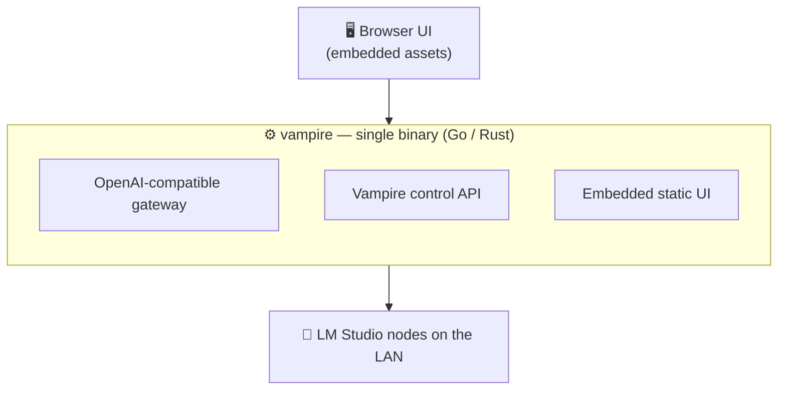

# METHOD-B — Single Go/Rust binary

Build the gateway as **one compiled, statically linked binary** (Go or Rust)
with the browser UI embedded inside it.

## Idea

A reverse-proxy-class workload — accept a request, fan out to nodes, stream back
— is exactly what Go and Rust excel at. Embed the SPA assets into the binary
(Go `embed`, or `rust-embed`) so the entire product is **one file** with no
runtime, interpreter, or `pip` step.

## Why consider it

- **Distribution.** `scp` a single binary to any machine, or ship one per OS.
  Ideal for the "one strong host in a classroom" story.
- **Performance + concurrency.** Goroutines / async Rust handle thousands of
  streaming connections with predictable memory; no event-loop blocking worries.
- **Footprint.** Tiny idle resource use on a shared family/gaming PC.
- **Robustness.** Static typing and no dependency tree reduce supply-chain and
  deployment surprises.

## Costs

- Slower iteration than Python for orchestration glue and policy logic.
- Embedding-based semantic cache or RAG features need more plumbing (or a sidecar).
- Smaller pool of contributors comfortable in Rust than in Python.

**Best when** the priority is rugged, zero-dependency distribution and raw
throughput over rapid feature experimentation.
