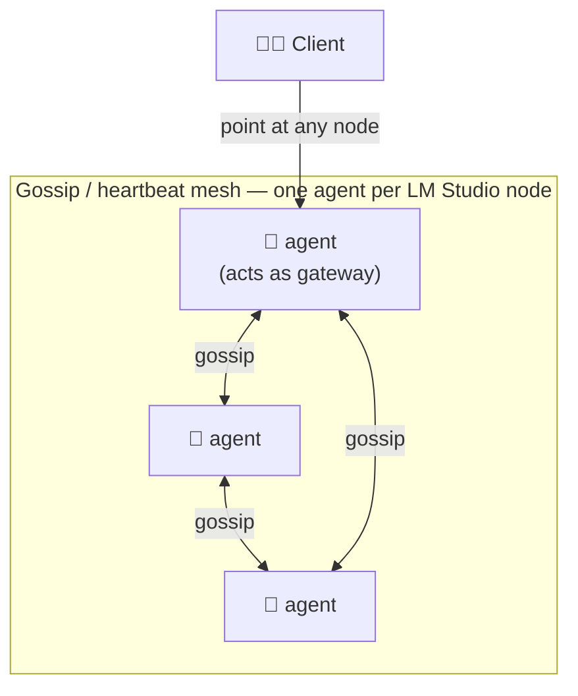

# METHOD-D — Distributed agent mesh (no central server)

Drop the single orchestrator. Run a small **agent on every LM Studio node**;
agents gossip to form a shared view, and any agent can act as the gateway.

## Idea

Instead of one machine routing for all, each node runs a lightweight agent
(matching the Layer-3 node-agent API in DESIGN-API). Agents share health, model
inventory, and load over a gossip protocol or a small embedded store. A client
can point at *any* agent; that agent routes, races, or fuses across the mesh.

## Why consider it

- **No single point of failure.** Lose a machine, the mesh continues; the gateway
  role is not pinned to one host.
- **Accurate local signals.** Each agent reports its own true GPU load and loaded
  models — better routing than remote polling.
- **Scales horizontally.** Add a machine, it joins the mesh and starts serving.
- **Natural fit for families/events** where machines come and go.

## Costs

- **Hardest to build.** Distributed consensus, membership, and split-brain
  handling are genuinely difficult.
- Security surface grows: every node now accepts and forwards traffic, so signed
  registration and per-node policy become mandatory, not optional.
- Harder to reason about and debug than a central router.

**Best when** resilience and "no central box to maintain" matter more than
implementation simplicity — likely a **later evolution** of METHOD-A rather than
a starting point.
