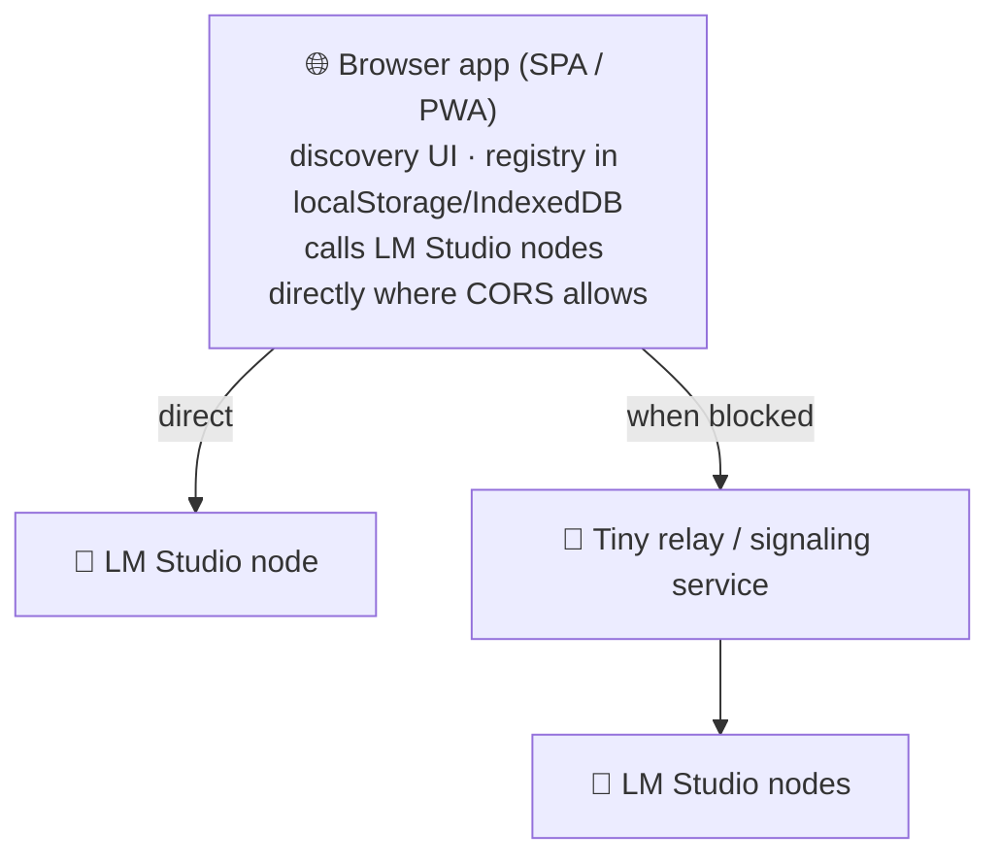

# METHOD-E — Browser-first, near-serverless

Push as much as possible into the **browser**, backed by only a thin relay.

## Idea

The user opens a web app — hosted statically or as a PWA — that discovers and
talks to LM Studio nodes directly from the browser when CORS/allowlist settings
permit. A minimal relay exists only to cover what browsers cannot do safely:
cross-origin fan-out, mDNS-style discovery, and holding tokens out of client code.

## Why consider it

- **Near-zero install.** Open a URL; no server to provision for casual use.
- **Lowest barrier** for "I just want to chat with the house GPU."
- **Naturally multi-client** — every tab is a user.

## Costs

- **CORS and browser sandboxing** block most LAN discovery and cross-origin
  calls; in practice a relay is still needed, so it is not truly serverless.
- **Token safety.** Secrets cannot live in browser code, forcing a server-side
  vault anyway — which undercuts the "no backend" promise.
- Routing/coalescing logic in the browser is fragile and per-tab; hard to apply
  org-wide policy.

**Best when** the goal is the simplest possible personal/family front door, used
as a **thin client to a METHOD-A backend** rather than a standalone architecture.
