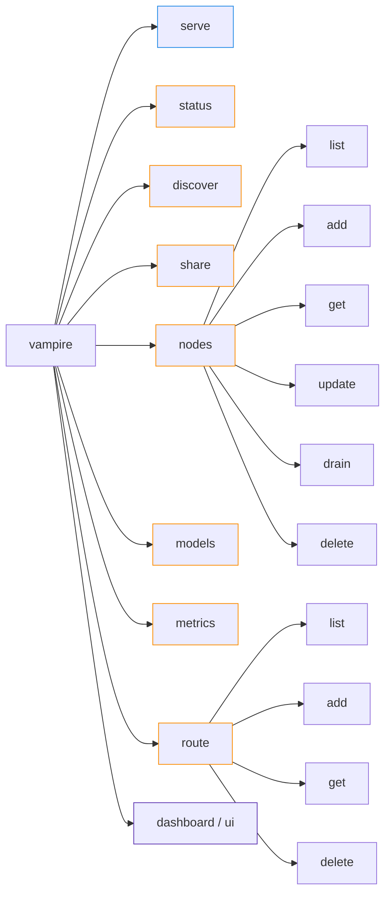

# `vampire` command reference

This directory holds **one help page per `vampire` command** — the terminal
operator's quick reference. Each page is written like a man page: a synopsis, a
description, every argument and flag, the control endpoint it calls, exit codes,
and worked examples.

Where the [operator manual](../manual/) reads as a narrative handbook and
[`05-cli-reference.md`](../manual/05-cli-reference.md) is the single-page command
index, these files are the **deep reference for an individual command**. They
document the behaviour that ships in the current scaffold (Phases 0–4); the
[roadmap](#roadmap--upcoming-commands) at the bottom plans the next 100 commands
from [`POSSIBLE-COMMANDS.md`](../../POSSIBLE-COMMANDS.md).

## How `vampire` is structured

`vampire serve` runs the gateway in this process. **Every other command is a thin
client** that calls the gateway's `/vampire/v1/*`
[control API](../manual/09-api-reference.md) and prints the JSON response with
sorted keys.

> **Blue** (`serve`) starts the server in this process. **Orange** commands are
> control-plane clients: they send HTTP to a running gateway. **Purple** commands
> are local CLI utilities.

## Shipped commands

| Command | Page | Purpose |
| --- | --- | --- |
| `vampire serve` | [serve.md](serve.md) | Run the OpenAI-compatible gateway. |
| `vampire status` | [status.md](status.md) | Show gateway and cluster status. |
| `vampire discover` | [discover.md](discover.md) | Discover reachable LM Studio nodes. |
| `vampire nodes` | [nodes.md](nodes.md) | Manage the node registry (`list`/`add`/`get`/`update`/`drain`/`delete`). |
| `vampire models` | [models.md](models.md) | List the aggregated model inventory. |
| `vampire metrics` | [metrics.md](metrics.md) | Show the dashboard metrics snapshot. |
| `vampire route` | [route.md](route.md) | Inspect or set routing rules (`list`/`add`/`get`/`delete`). |
| `vampire share` | [share.md](share.md) | Control owner sharing modes. |
| `vampire dashboard` / `vampire ui` | [dashboard.md](dashboard.md) | Print or open the browser dashboard URL. |

## Global options

| Option | Applies to | Description |
| --- | --- | --- |
| `--version` | `vampire` | Print the installed version and exit. |
| `-h`, `--help` | every command | Print argparse help for that command and exit. |
| `--gateway URL` | all control commands | Base URL of the running gateway. Default `http://127.0.0.1:7777`. |

## Conventions used on every page

- **Synopsis** uses `UPPERCASE` for required positional arguments and
  `[brackets]` for optional flags. `...` marks a repeatable flag.
- **Calls** names the control endpoint the command invokes (or "local" when it
  does not touch the gateway).
- Control commands print the JSON response body with `indent=2` and sorted keys,
  so output is stable and diff-friendly for scripting.

## Exit codes

Shared by every control command:

| Code | Meaning |
| --- | --- |
| `0` | Success (HTTP 2xx, or `serve` exited cleanly). |
| `1` | The gateway returned a non-success status, or could not be reached. |
| `2` | Invalid arguments (e.g. a malformed `node:model` target, or `share off on`). |

## Roadmap — upcoming commands

The shipped surface above is intentionally small. The next 100 planned commands,
ranked by importance and mapped to [POSSIBILITIES.md](../../POSSIBILITIES.md) and
the [implementation plan](../../IMPLEMENTATION-PLAN.md), are catalogued in
[`POSSIBLE-COMMANDS.md`](../../POSSIBLE-COMMANDS.md). They are grouped into ten
tiers:

| Tier | Theme | Examples |
| --- | --- | --- |
| 1 | Finish & harden the MVP surface | `chat`, `embed`, `complete`, `health`, `config`, `doctor` |
| 2 | Routing, reliability, failover | `route test`, `failover`, `queue`, `retry policy` |
| 3 | Discovery & node lifecycle | `discover --method mdns`, `pair`, `nodes import/export` |
| 4 | Observability & dashboards | `history`, `stats`, `latency`, `bench`, `watch` |
| 5 | Security, policy, access control | `token`, `auth`, `policy`, `quota`, `audit log` |
| 6 | Performance: coalescing & caching | `cache`, `coalesce`, `warmup`, `prefetch` |
| 7 | Fusion & ensemble | `fusion run`, `race`, `vote`, `judge`, `debate` |
| 8 | Pipelines, jobs & traces | `pipeline run`, `jobs list`, `trace get`, `batch run` |
| 9 | Local RAG & knowledge | `rag index`, `rag query`, `rag collections` |
| 10 | JAPER secure fabric & deployment | `sign verify`, `trust score`, `daemon` |

As each planned command ships, add a `docs/command/{command}.md` page following
the same template as the shipped pages, link it from the
[Shipped commands](#shipped-commands) table, and move it out of the roadmap.

## See also

- [CLI reference](../manual/05-cli-reference.md) — single-page command index.
- [API reference](../manual/09-api-reference.md) — the HTTP endpoints behind each command.
- [Configuration](../manual/04-configuration.md) — `VAMPIRE_*` settings and `.env`.
- [Troubleshooting](../manual/10-troubleshooting.md) — when a command misbehaves.
