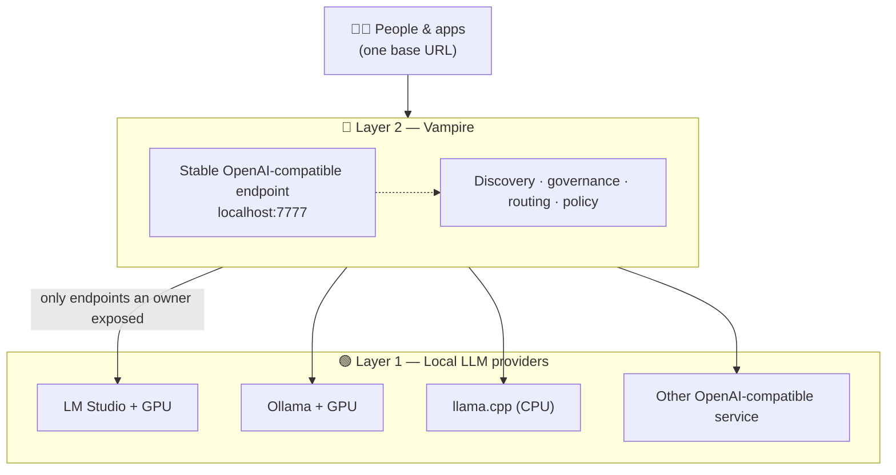

# 1. Introduction

> One governed endpoint for local LLM services, wherever their owners allow it.

## What `llm-vampire` is

`llm-vampire` is a gateway that sits in front of one or more **local LLM**
servers and presents them to clients as a single, stable, OpenAI-compatible
endpoint. You run it as one process — `vampire serve` — and point your existing
OpenAI-compatible tools at it instead of at a single provider.

Vampire deliberately does **not**:

- run models itself,
- discover or control GPUs directly, or
- bypass any control a service owner has set.

Instead it connects only to local LLM endpoints an owner has *deliberately
exposed*, interrogates what those endpoints offer, and routes approved requests
behind one governed URL. Each service owner stays in control of whether the
server runs, which port is open, which tokens are valid, which models load, and
whether the network can reach it at all.

For the deeper rationale see [VISION.md](../../VISION.md),
[ASPIRATION.md](../../ASPIRATION.md), and the README section
[About LM Studio](../../README.md#about-lm-studio).

## Who this is for

| Audience | What Vampire gives them |
| --- | --- |
| **Developers** | A single local base URL that fronts one or more provider services instead of hard-coding one host. |
| **Families** | A way to turn a home gaming PC's GPU into a shared, private AI appliance. |
| **Small businesses** | A way to reuse workstation capacity before renting more cloud compute. |
| **Classrooms & events** | One strong host made available, under control, to a room full of clients. |

The [use-case catalogue](../use-case/README.md) walks through these network
topographies in detail.

## The mental model

Vampire is a two-layer system:

- **Layer 1 — local providers** supply compute and model APIs. Vampire supports
  OpenAI-compatible `/v1/*` surfaces and native Ollama inventory.
- **Layer 2 — Vampire** aggregates those machines, applies routing and policy,
  and serves one endpoint (default `http://localhost:7777`).

A client never needs to know which machine answered. It sends an ordinary
OpenAI-style request to Vampire; Vampire proxies or routes it to an appropriate
local LLM node and returns the response — preserving streaming and OpenAI-style
errors along the way.

## What runs today

The current scaffold implements the first four phases of
[IMPLEMENTATION-PLAN.md](../../IMPLEMENTATION-PLAN.md):

| Phase | Capability | Status |
| --- | --- | --- |
| 0 | Installable package, `vampire` CLI, FastAPI app, settings, models, tests, lint, types | ✅ Implemented |
| 1 | Transparent `/v1/*` proxy to one local LLM node, with streaming and error passthrough | ✅ Implemented |
| 2 | In-memory node registry, provider-aware model interrogation, static + local multi-port discovery, basic metrics | ✅ Implemented |
| 3 | Virtual models, route policies, MVP routing strategies, opt-in request routing, `X-Vampire-*` response headers | ✅ Implemented |
| 4 | Browser dashboard for status, nodes, discovery, models, routes, metrics, sharing, and prompts | ✅ Implemented |
| 5+ | Cache/coalescing, auth/policy, fusion modes | 🔜 Planned |

> The project is **not affiliated with LM Studio** unless explicitly adopted by
> that team.

## Where to go next

- New here? Continue to [Installation](02-installation.md), then the
  [Quick start](03-quickstart.md).
- Already running? Jump to the [CLI reference](05-cli-reference.md) or
  [Nodes & discovery](06-nodes-and-discovery.md).
