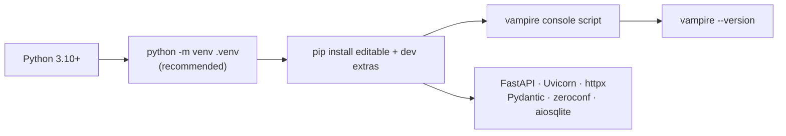

# 2. Installation

This chapter covers installing the current `llm-vampire` scaffold. The
single-command installers advertised in the README are a **planned** future
deliverable; today you install from a checkout with `pip`.

## Requirements

| Requirement | Notes |
| --- | --- |
| **Python 3.10+** | The package targets `>=3.10` (see [`pyproject.toml`](../../pyproject.toml)). |
| **pip** | Used to install the package and its dependencies. |
| **A local LLM endpoint** | At least one reachable service, such as LM Studio (`http://localhost:1234`), Ollama (`http://localhost:11434`), llama.cpp, or another OpenAI-compatible server. |

Runtime dependencies (FastAPI, Uvicorn, httpx, Pydantic, pydantic-settings,
zeroconf, aiosqlite) are installed automatically by `pip`.

## Install from a checkout

Clone the repository (or use your existing checkout) and install it in editable
mode with the development extras:

```bash
pip install -e ".[dev]"
```

This installs the package, the `vampire` console script, and the development
tools used for validation (`ruff`, `mypy`, `pytest`).



> **Tip — use a virtual environment.** Create an isolated environment first so
> Vampire's dependencies do not collide with other projects:
>
> ```bash
> python -m venv .venv
> source .venv/bin/activate     # Windows PowerShell: .venv\Scripts\Activate.ps1
> pip install -e ".[dev]"
> ```

## Verify the install

Confirm the console script is on your path and reports its version:

```bash
vampire --version
```

You should see output like `vampire 0.0.1`.

## Run the validation suite (optional)

The same checks CI runs validate that your environment is healthy. From the
repository root:

```bash
ruff format --check .
ruff check .
mypy
pytest
```

All four should pass on a clean checkout. These are the project's standard
formatting, linting, type-checking, and test commands.

## What gets installed

| Component | Purpose |
| --- | --- |
| `vampire` console script | The CLI entry point (`vampire.cli:main`). See the [CLI reference](05-cli-reference.md). |
| `vampire-desktop` console script | Desktop-friendly launcher that starts the gateway and opens the dashboard. |
| `vampire` Python package | The FastAPI app, proxy, registry, router, and models under `src/vampire/`. |
| `src/vampire/assets/vampire-dashboard.html` | The product-bundled Phase 4 browser dashboard served at `/`. |

## Next steps

Continue to the [Quick start](03-quickstart.md) to launch the gateway and serve
your first request.
