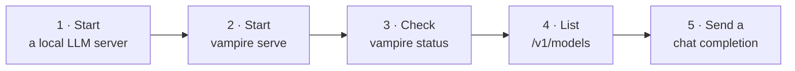
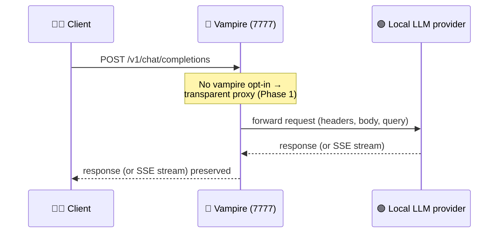

# 3. Quick start

This chapter takes you from a fresh install to a working request in a few
minutes. It assumes you have completed [Installation](02-installation.md).



## Step 1 — Start a local LLM server

Vampire needs at least one local LLM endpoint. You can use LM Studio, Ollama,
llama.cpp, LocalAI, vLLM, or another OpenAI-compatible server. For example, open
LM Studio's **Developer** tab and start its local server, which defaults to:

```text
http://localhost:1234
```

Load at least one model so the server has something to serve. For headless and
CLI options, see [`lmstudio.ai/02-api-server.md`](../../lmstudio.ai/02-api-server.md)
and [`lmstudio.ai/10-cli.md`](../../lmstudio.ai/10-cli.md).

## Step 2 — Start the Vampire gateway

From your checkout (or anywhere, once installed):

```bash
vampire serve
```

The gateway starts and listens on:

```text
http://localhost:7777
```

Its OpenAI-compatible base URL is therefore:

```text
http://localhost:7777/v1
```

> By default Vampire binds to `127.0.0.1:7777` and proxies to a single
> downstream node at `http://localhost:1234`. To change either, see
> [Configuration](04-configuration.md). For example, to front a different node:
>
> ```bash
> VAMPIRE_DEFAULT_BASE_URL=http://llm-host:1234 vampire serve
> ```

## Step 3 — Check it is alive

In another terminal, ask the gateway for its status:

```bash
vampire status
```

You should get a JSON envelope describing the cluster, for example:

```json
{
  "nodes_online": 0,
  "nodes_total": 0,
  "object": "vampire.status",
  "version": "0.0.1"
}
```

`nodes_total` is `0` until you register nodes (Phase 2) — in Phase 1, Vampire
still proxies to the single configured downstream node even with an empty
registry.

## Step 4 — List models through Vampire

```bash
curl http://localhost:7777/v1/models
```

With no nodes registered, this transparently returns the configured provider
node's `/v1/models` response. Once you register nodes, Vampire aggregates models
across them (see [Nodes & discovery](06-nodes-and-discovery.md)).

## Step 5 — Send a chat completion

Point any OpenAI-compatible client at `http://localhost:7777/v1`. With `curl`:

```bash
curl http://localhost:7777/v1/chat/completions \
  -H "Content-Type: application/json" \
  -d '{
    "model": "your-loaded-model-id",
    "messages": [{"role": "user", "content": "Say hello in one sentence."}]
  }'
```

Replace `your-loaded-model-id` with a model id reported by
`GET /v1/models`. Streaming works too — add `"stream": true` and Vampire
preserves the Server-Sent Events stream end to end.

Here is what happens when that request reaches the gateway:



### Using an OpenAI SDK

Most clients only need the base URL changed. For example, with the OpenAI Python
SDK:

```python
from openai import OpenAI

client = OpenAI(base_url="http://localhost:7777/v1", api_key="not-needed")
resp = client.chat.completions.create(
    model="your-loaded-model-id",
    messages=[{"role": "user", "content": "Hello!"}],
)
print(resp.choices[0].message.content)
```

> The OpenAI-compatible `/v1/*` surface does not require an API key by default.
> Setting `VAMPIRE_AUTH_TOKEN` now requires an authorization bearer token on the
> Vampire control API at `/vampire/v1/*`.

## What you have now

- A gateway on `http://localhost:7777` fronting your local LLM service.
- A drop-in OpenAI-compatible surface at `/v1/*`.
- A control surface at `/vampire/v1/*` and the matching `vampire` CLI.

## Where to go next

- Add more machines: [Nodes & discovery](06-nodes-and-discovery.md).
- Route a single virtual model across nodes: [Routing](07-routing.md).
- Tune host, port, and downstream URL: [Configuration](04-configuration.md).
- See every command: [CLI reference](05-cli-reference.md).
