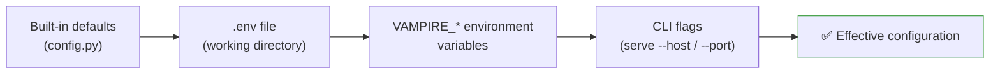
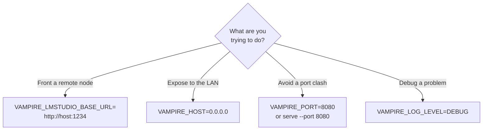

# 4. Configuration

Vampire reads its runtime configuration from three sources, in order of
increasing precedence. Settings are defined in
[`src/vampire/config.py`](../../src/vampire/config.py) and all carry the
`VAMPIRE_` prefix.

## Settings precedence



Later sources override earlier ones. For example, a `VAMPIRE_PORT` environment
variable overrides the default, and `vampire serve --port` overrides that for the
listen address.

> **Note.** CLI flags only take precedence for the settings they expose. Today
> `vampire serve` exposes `--host` and `--port`; all other settings come from
> defaults, `.env`, and environment variables.

## Settings reference

| Setting | Environment variable | Default | Purpose |
| --- | --- | --- | --- |
| `host` | `VAMPIRE_HOST` | `127.0.0.1` | Address the gateway binds to when `vampire serve` starts. |
| `port` | `VAMPIRE_PORT` | `7777` | Port the gateway listens on. |
| `lmstudio_base_url` | `VAMPIRE_LMSTUDIO_BASE_URL` | `http://localhost:1234` | Default downstream LM Studio node used by the Phase 1 transparent proxy. |
| `log_level` | `VAMPIRE_LOG_LEVEL` | `INFO` | Logging verbosity for the gateway process. |
| `auth_token` | `VAMPIRE_AUTH_TOKEN` | `""` (empty) | Local API key for **planned** Phase 6 policy. Empty keeps Phase 1 drop-in compatibility unauthenticated. |

## Setting configuration

### Environment variables

Prefix any setting name with `VAMPIRE_` and uppercase it:

```bash
VAMPIRE_HOST=0.0.0.0 \
VAMPIRE_PORT=8080 \
VAMPIRE_LMSTUDIO_BASE_URL=http://lm-studio-host:1234 \
vampire serve
```

### A `.env` file

Create a `.env` file in the directory you run `vampire` from:

```dotenv
# .env
VAMPIRE_HOST=0.0.0.0
VAMPIRE_PORT=8080
VAMPIRE_LMSTUDIO_BASE_URL=http://lm-studio-host:1234
VAMPIRE_LOG_LEVEL=DEBUG
```

Values in `.env` are loaded automatically by pydantic-settings.

### CLI flags

For host and port, flags override everything else for the lifetime of that
`serve` invocation:

```bash
vampire serve --host 0.0.0.0 --port 8080
```

## Common configurations



> **Security note.** Binding to `0.0.0.0` exposes the gateway on your network.
> The current scaffold does not enforce authentication, so only do this on a
> trusted network. Owner-side controls (tokens, allowlists, realms) are part of
> the **planned** Phase 6 policy layer — see
> [IMPLEMENTATION-PLAN.md](../../IMPLEMENTATION-PLAN.md).

## Next steps

With configuration understood, see the [CLI reference](05-cli-reference.md) for
every command, or [Nodes & discovery](06-nodes-and-discovery.md) to register
more machines.
