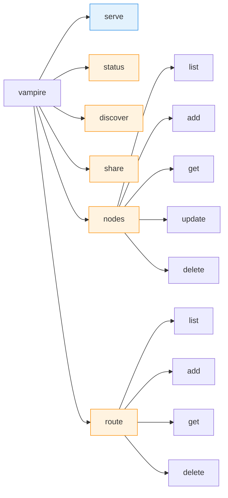
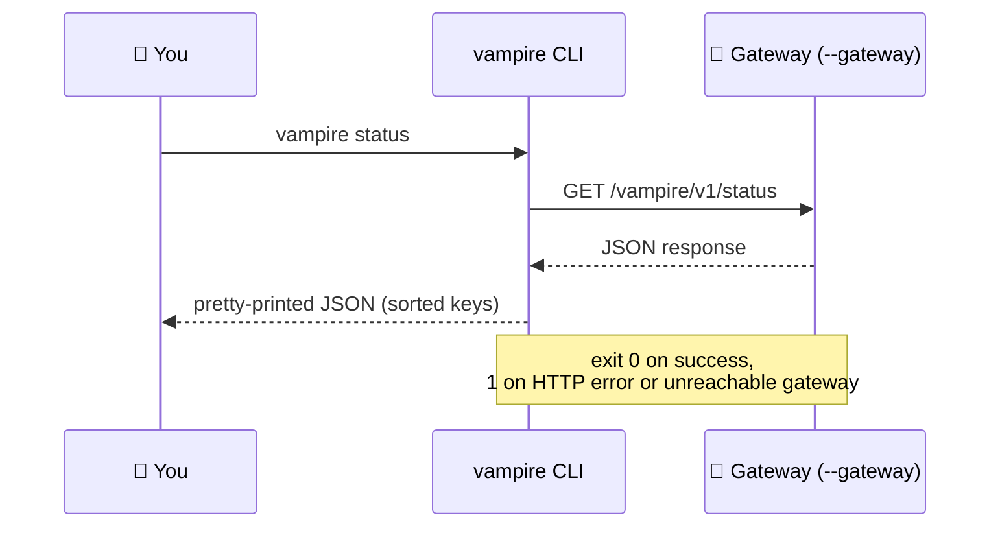

# 5. CLI reference

The `vampire` command is the operator's entry point. `vampire serve` runs the
gateway; every other command is a thin client that calls the gateway's
`/vampire/v1/*` [control API](09-api-reference.md) and prints the JSON response.

## Command map



> **Blue** (`serve`) starts the server in this process. **Orange** commands are
> control-plane clients: they send HTTP requests to a running gateway.

## How control commands reach the gateway



Every control command accepts `--gateway URL` to target a non-default gateway
(default `http://127.0.0.1:7777`).

## Global options

| Option | Applies to | Description |
| --- | --- | --- |
| `--version` | `vampire` | Print the version and exit. |
| `--gateway URL` | all control commands | Base URL of the running gateway. Default `http://127.0.0.1:7777`. |

## `vampire serve`

Run the OpenAI-compatible gateway in the foreground (via Uvicorn).

```bash
vampire serve [--host HOST] [--port PORT]
```

| Flag | Default | Description |
| --- | --- | --- |
| `--host` | `127.0.0.1` (from settings) | Address to bind. |
| `--port` | `7777` (from settings) | Port to bind. |

Flags override the corresponding [settings](04-configuration.md). All other
configuration comes from `VAMPIRE_*` variables and `.env`.

## `vampire status`

Show the gateway and cluster status envelope.

```bash
vampire status [--gateway URL]
```

Calls `GET /vampire/v1/status`. Reports `version`, `nodes_total`, and
`nodes_online`.

## `vampire discover`

Ask the gateway to discover reachable LM Studio nodes.

```bash
vampire discover [--method M]... [--subnet CIDR]... [--port N]... \
                 [--timeout-ms MS] [--trusted-only] [--base-url URL]...
```

| Flag | Repeatable | Default | Description |
| --- | --- | --- | --- |
| `--method` | yes | `static` | Discovery method(s): `static`, `lan_scan`. |
| `--subnet` | yes | (none) | CIDR subnet(s) to scan when using `lan_scan`. |
| `--port` | yes | `1234` | Port(s) to probe. |
| `--timeout-ms` | no | `1500` | Per-node probe timeout in milliseconds. |
| `--trusted-only` | no | off | Only return nodes marked trusted. |
| `--base-url` | yes | (none) | Explicit base URL(s) to probe directly. |

Calls `POST /vampire/v1/discover`. See [Nodes & discovery](06-nodes-and-discovery.md).

## `vampire nodes`

Manage the in-memory node registry. With no subcommand, defaults to `list`.

```bash
vampire nodes [--gateway URL] [SUBCOMMAND]
```

| Subcommand | Calls | Description |
| --- | --- | --- |
| `list` | `GET /vampire/v1/nodes` | List registered nodes. |
| `add NODE_ID LMSTUDIO_BASE_URL [...]` | `POST /vampire/v1/nodes` | Register an owner-approved node. |
| `get NODE_ID` | `GET /vampire/v1/nodes/{id}` | Show one node. |
| `update NODE_ID [...]` | `PATCH /vampire/v1/nodes/{id}` | Patch mutable node metadata. |
| `delete NODE_ID` | `DELETE /vampire/v1/nodes/{id}` | Remove a node. |

### `vampire nodes add`

```bash
vampire nodes add NODE_ID LMSTUDIO_BASE_URL \
  [--name NAME] [--host HOST] [--agent-base-url URL] [--trusted] [--tag TAG]...
```

| Argument / flag | Description |
| --- | --- |
| `NODE_ID` | Unique id for the node. |
| `LMSTUDIO_BASE_URL` | The node's OpenAI-compatible base URL (e.g. `http://host:1234`). |
| `--name` | Friendly display name. |
| `--host` | Host label. |
| `--agent-base-url` | Reserved for the optional node agent (post-MVP). |
| `--trusted` | Mark the node trusted. |
| `--tag` | Add a tag (repeatable). |

### `vampire nodes update`

```bash
vampire nodes update NODE_ID \
  [--name N] [--host H] [--lmstudio-base-url URL] [--agent-base-url URL] \
  [--trusted] [--tag TAG]... \
  [--active-requests N] [--queue-depth N] [--tokens-per-second F]
```

Only the flags you pass are sent in the `PATCH` body.

## `vampire route`

Inspect or set virtual-model routing rules. With no subcommand, defaults to
`list`.

```bash
vampire route [--gateway URL] [SUBCOMMAND]
```

| Subcommand | Calls | Description |
| --- | --- | --- |
| `list` | `GET /vampire/v1/routes` | List route policies. |
| `add ROUTE_ID VIRTUAL_MODEL --target node:model [...]` | `POST /vampire/v1/routes` | Create or replace a route policy. |
| `get ROUTE_ID` | `GET /vampire/v1/routes/{id}` | Show a route policy. |
| `delete ROUTE_ID` | `DELETE /vampire/v1/routes/{id}` | Remove a route policy. |

### `vampire route add`

```bash
vampire route add ROUTE_ID VIRTUAL_MODEL \
  --target node:model [--target node:model]... \
  [--strategy STRATEGY] [--fallback VIRTUAL_MODEL]
```

| Argument / flag | Description |
| --- | --- |
| `ROUTE_ID` | Unique id for the route policy. |
| `VIRTUAL_MODEL` | The virtual model id clients request (e.g. `vampire:chat`). |
| `--target` | A `node:model` target (required, repeatable). |
| `--strategy` | One of `round_robin` (default), `least_busy`, `least_latency`, `model_affinity`, `trusted_only`. |
| `--fallback` | Virtual model to fall back to when no target is available. |

See [Routing](07-routing.md) for full details.

## `vampire share`

Set the owner sharing mode.

```bash
vampire share MODE [on|off] [--duration DURATION] [--model MODEL]
```

| Argument / flag | Description |
| --- | --- |
| `MODE` | One of `on`, `off`, `local`, `personal`, `family`, `business`, `event`, `stop`. |
| `on`/`off` (state) | Optional enable/disable state. Not allowed with `off`/`stop`. |
| `--duration` | Optional duration the share stays active. |
| `--model` | Optional model to scope the share to. |

`on` is normalised to `local`; `stop` is normalised to `off`. See
[Sharing modes](08-sharing-modes.md).

## Exit codes

| Code | Meaning |
| --- | --- |
| `0` | Success (HTTP 2xx, or `serve` exited cleanly). |
| `1` | The gateway returned a non-success status, or could not be reached. |
| `2` | Invalid arguments (e.g. a malformed `node:model` target, or `share off on`). |
