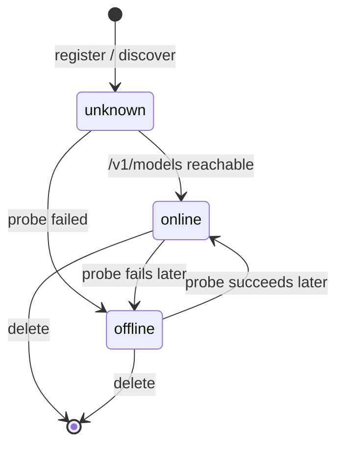
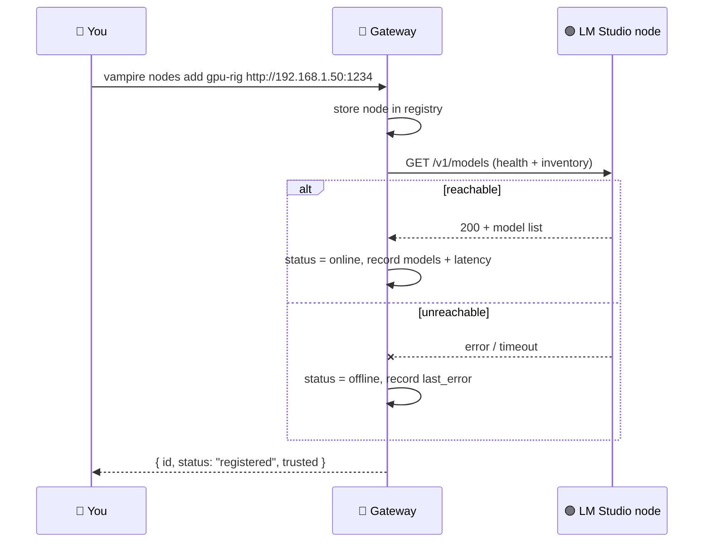
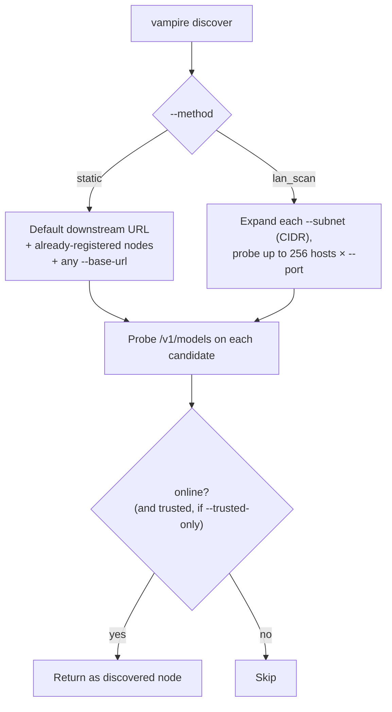
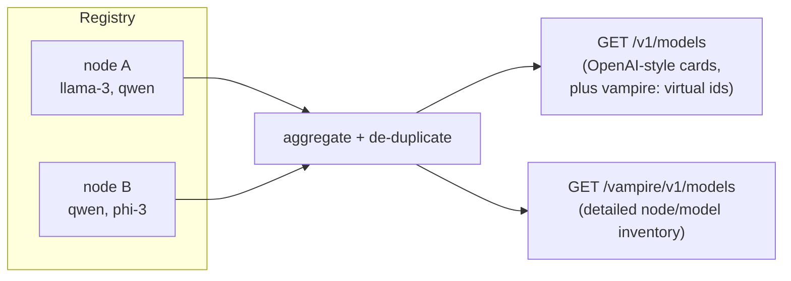

# 6. Nodes & discovery

A **node** is one machine running an owner-approved LM Studio API endpoint.
Vampire keeps an in-memory **registry** of nodes and can **discover** reachable
ones. This is Phase 2 of [IMPLEMENTATION-PLAN.md](../../IMPLEMENTATION-PLAN.md).

> **In-memory registry.** The registry lives in the running gateway process.
> Restarting `vampire serve` clears it. Persistent storage is a **planned**
> later-phase capability.

## The node lifecycle



Whenever a node is registered, patched, or discovered, Vampire interrogates its
`/v1/models` endpoint to set `status` (`online`/`offline`), capture its model
list, and record latency and error metadata.

## Registering a node

```bash
vampire nodes add gpu-rig http://192.168.1.50:1234 --name "Studio GPU" --trusted --tag fast
```

This sends a `POST /vampire/v1/nodes` and immediately interrogates the node:



## Inspecting the registry

```bash
vampire nodes list          # all nodes
vampire nodes get gpu-rig   # one node, with health + models
vampire status              # cluster summary: nodes_total / nodes_online
```

## Updating and removing nodes

```bash
vampire nodes update gpu-rig --tokens-per-second 42 --tag preferred
vampire nodes delete gpu-rig
```

Only the fields you pass are changed; updating also re-interrogates the node.

## Discovery

`vampire discover` asks the gateway to find reachable LM Studio endpoints. The
scaffold supports two methods:



### Static discovery

```bash
vampire discover --method static --base-url http://192.168.1.50:1234
```

Static discovery probes the configured downstream URL, every already-registered
node, and any `--base-url` you provide. Equivalent localhost / loopback /
local-interface aliases are de-duplicated to a single preferred URL.

### Dev-subnet scan

```bash
vampire discover --method lan_scan --subnet 192.168.1.0/24 --port 1234 --timeout-ms 1000
```

`lan_scan` expands each subnet and probes up to **256 hosts** per subnet on each
listed port. Use it on small development subnets; it is not a full network
sweep.

> **`--trusted-only`.** When set, discovery only returns nodes marked trusted.
> Without it, newly discovered nodes are treated as trusted candidates.

## Aggregated models

Once nodes are registered, model listings aggregate across them:



- `GET /v1/models` returns de-duplicated OpenAI-style model cards across all
  online nodes, plus Vampire virtual model ids (e.g. `vampire:auto` and any
  configured routes).
- `GET /vampire/v1/models` returns a detailed physical inventory of each
  `node` + `model` pair.

With **no** nodes registered, `GET /v1/models` falls back to a transparent
proxy of the single configured downstream node (Phase 1 behaviour).

## Next steps

Turn a set of nodes into a single client-facing model id with
[Routing](07-routing.md).
