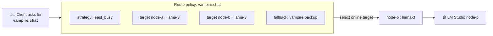
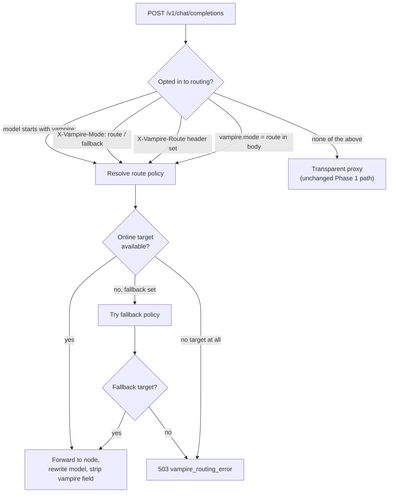

# 7. Routing

Routing lets clients request a single **virtual model** that Vampire resolves to
a concrete node and model using a **route policy**. This is Phase 3 of
[IMPLEMENTATION-PLAN.md](../../IMPLEMENTATION-PLAN.md).

Routing is **opt-in**: ordinary OpenAI-compatible requests keep flowing through
the transparent proxy unchanged. A request is only routed when it explicitly
asks for it.

## Virtual models vs. physical models



A **virtual model** (e.g. `vampire:chat`) is an alias. A **route policy** binds
that alias to one or more `node:model` **targets** plus a **strategy** for
picking among them.

## Creating a route

```bash
vampire route add chat vampire:chat \
  --target node-a:llama-3 \
  --target node-b:llama-3 \
  --strategy least_busy \
  --fallback vampire:backup
```

This sends `POST /vampire/v1/routes`. Inspect routes with:

```bash
vampire route list
vampire route get chat
vampire route delete chat
```

> Targets use `node:model` syntax. A malformed target (missing the `node` or
> `model` half) is rejected by the CLI with exit code `2`.

## Strategies

| Strategy | Picks the target that… |
| --- | --- |
| `round_robin` (default) | is next in rotation. |
| `least_busy` | has the fewest active requests / queue depth. |
| `least_latency` | has the lowest recorded latency. |
| `model_affinity` | best matches the requested model. |
| `trusted_only` | is marked trusted. |

Only these MVP strategies are accepted; `POST /vampire/v1/routes` rejects any
other strategy with HTTP 400.

## How a request opts in to routing



A request is routed when **any** of these is true:

- the `model` field starts with `vampire:`, or
- the `X-Vampire-Mode` header (or `vampire.mode` in the body) is `route` or
  `fallback`, or
- the `X-Vampire-Route` header is present.

Otherwise the request is proxied transparently, exactly as in
[Phase 1](03-quickstart.md).

### Example: route by virtual model id

```bash
curl http://localhost:7777/v1/chat/completions \
  -H "Content-Type: application/json" \
  -d '{
    "model": "vampire:chat",
    "messages": [{"role": "user", "content": "Hello"}]
  }'
```

### Example: route an ordinary model with headers

```bash
curl http://localhost:7777/v1/chat/completions \
  -H "Content-Type: application/json" \
  -H "X-Vampire-Mode: route" \
  -H "X-Vampire-Strategy: least_busy" \
  -d '{ "model": "llama-3", "messages": [{"role":"user","content":"Hi"}] }'
```

You can also pass these as an opt-in `vampire` object in the body:

```json
{
  "model": "llama-3",
  "messages": [{ "role": "user", "content": "Hi" }],
  "vampire": { "mode": "route", "routing": { "strategy": "least_busy" } }
}
```

## Response headers

When Vampire routes a request, it adds headers describing the decision so
clients and proxies can observe where the work went:

| Header | Meaning |
| --- | --- |
| `X-Vampire-Route` | The route policy id used. |
| `X-Vampire-Strategy` | The strategy applied. |
| `X-Vampire-Node` | The node the request was sent to. |
| `X-Vampire-Model` | The physical model the request was rewritten to. |

## When no target is available

If a route resolves to no online target — and no usable fallback — Vampire
returns HTTP `503` with an OpenAI-style error envelope:

```json
{
  "error": {
    "message": "No online route target available for vampire:chat.",
    "type": "vampire_routing_error",
    "code": "no_route_target"
  }
}
```

## Next steps

Control whether and how a node is offered with [Sharing modes](08-sharing-modes.md),
or see the full [API reference](09-api-reference.md).
