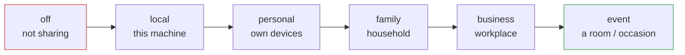
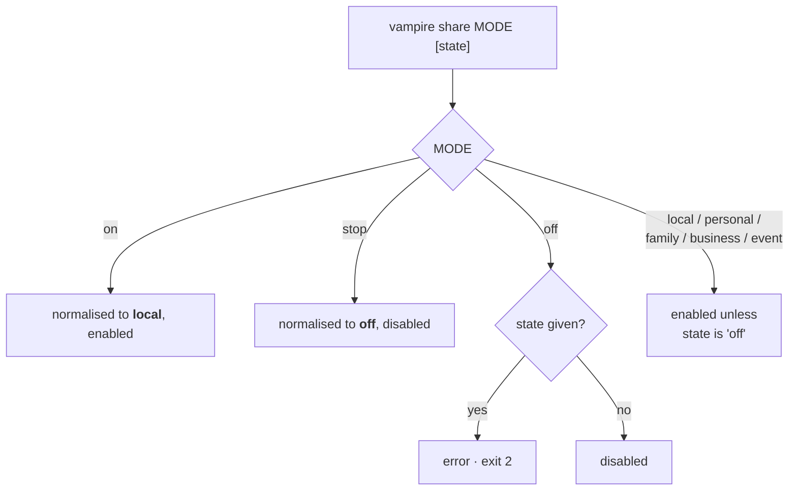

# 8. Sharing modes

**Sharing modes** express *how widely* an owner is offering their compute. The
`vampire share` command records the current mode through the
`/vampire/v1/share` control endpoint.

> **Design-stage seam.** Today this is an **in-memory state seam**: it records
> the owner's chosen mode but does **not yet enforce policy**. Enforcement
> (tokens, realms, allowlists) arrives with the **planned** Phase 6 policy layer.
> Use it now to model intent and integrate early; do not rely on it for access
> control yet.

## The sharing scale



Modes run from fully private (`off`) to broadly offered (`event`). The mode is a
declaration of scope; each LM Studio owner still controls their own server.

## Setting a mode

```bash
vampire share family               # enable the "family" mode
vampire share local on             # explicit enable state
vampire share business --duration 8h --model llama-3
vampire share off                  # stop sharing
```

### Argument behaviour



| Input | Effect |
| --- | --- |
| `vampire share on` | Normalised to mode `local`, enabled. |
| `vampire share stop` | Normalised to mode `off`, disabled. |
| `vampire share off` | Mode `off`, disabled. |
| `vampire share family` | Mode `family`, enabled. |
| `vampire share family off` | Mode `family`, disabled. |
| `vampire share off on` | **Error** — `off`/`stop` do not accept a state (exit code `2`). |

### Optional flags

| Flag | Description |
| --- | --- |
| `--duration` | How long the share should stay active (free-form, e.g. `8h`). |
| `--model` | Scope the share to a single model id. |

## Reading the current mode

The control API exposes the current share status:

```bash
curl http://localhost:7777/vampire/v1/share
```

```json
{
  "object": "vampire.share",
  "mode": "family",
  "enabled": true,
  "duration": "8h",
  "model": null
}
```

## Next steps

See the complete HTTP surface in the [API reference](09-api-reference.md).
