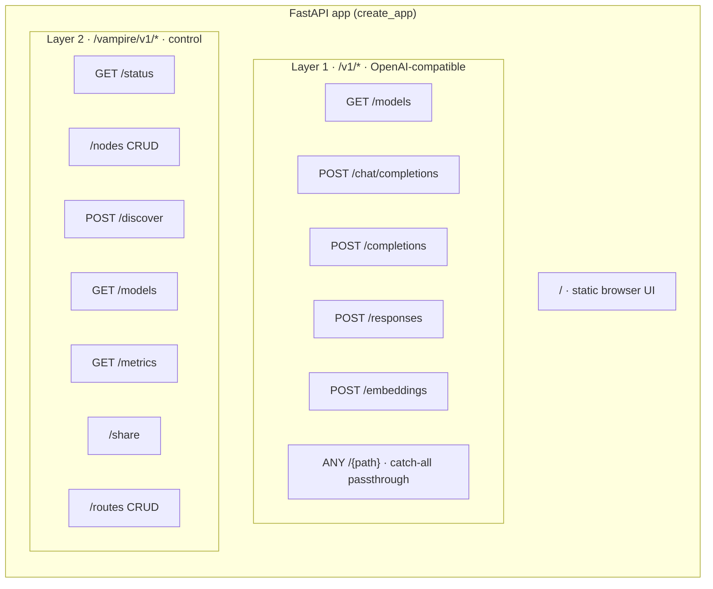
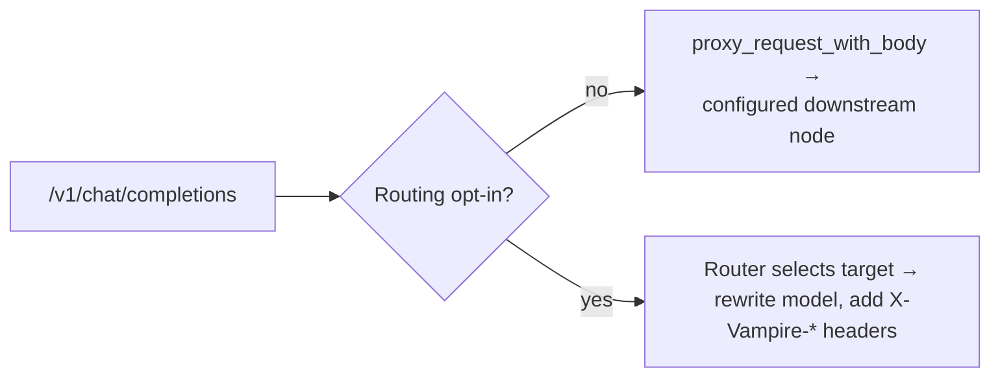

# 9. API reference

Vampire serves three surfaces from one process. This chapter documents the HTTP
endpoints the current scaffold implements. For the full design specification
(including planned endpoints), see [DESIGN-API.md](../../DESIGN-API.md).

## Surface map



---

## Layer 1 — OpenAI-compatible (`/v1/*`)

These are the drop-in compatibility routes. Unless a request opts in to
[routing](07-routing.md), each is forwarded transparently to LM Studio,
preserving query strings, headers, JSON bodies, streaming, and OpenAI-style
errors.

| Method | Path | Description |
| --- | --- | --- |
| `GET` | `/v1/models` | Aggregated model cards across registered nodes (plus `vampire:` virtual ids); falls back to a transparent proxy when no nodes are registered. |
| `POST` | `/v1/chat/completions` | Chat completions; routed when opted in, else proxied. Supports SSE streaming. |
| `POST` | `/v1/completions` | Legacy text completions. |
| `POST` | `/v1/responses` | OpenAI-compatible Responses endpoint, when the node serves it. |
| `POST` | `/v1/embeddings` | Embeddings. |
| `ANY` | `/v1/{path}` | Catch-all passthrough so any other compatible path keeps working. |

### Proxy vs. route decision



See [Routing](07-routing.md) for the opt-in signals and response headers.

---

## Layer 2 — Vampire control (`/vampire/v1/*`)

### Status & metrics

| Method | Path | Description |
| --- | --- | --- |
| `GET` | `/vampire/v1/status` | Cluster status: `version`, `nodes_total`, `nodes_online`. |
| `GET` | `/vampire/v1/metrics` | Per-node health, request counts, latency, and cluster totals. |

### Nodes

| Method | Path | Description |
| --- | --- | --- |
| `GET` | `/vampire/v1/nodes` | List registered nodes (`{ "object": "list", "data": [...] }`). |
| `POST` | `/vampire/v1/nodes` | Register/replace a node, then interrogate `/v1/models`. |
| `GET` | `/vampire/v1/nodes/{id}` | Get one node, or `404`. |
| `PATCH` | `/vampire/v1/nodes/{id}` | Partially update a node and refresh it, or `404`. |
| `DELETE` | `/vampire/v1/nodes/{id}` | Remove a node, or `404`. |

### Discovery & models

| Method | Path | Description |
| --- | --- | --- |
| `POST` | `/vampire/v1/discover` | Run static / dev-subnet discovery; returns online nodes. |
| `GET` | `/vampire/v1/models` | Detailed physical `node` + `model` inventory across nodes. |

### Routes

| Method | Path | Description |
| --- | --- | --- |
| `GET` | `/vampire/v1/routes` | List route policies. |
| `POST` | `/vampire/v1/routes` | Create/replace a route policy (`400` for unsupported strategy). |
| `GET` | `/vampire/v1/routes/{id}` | Get one route, or `404`. |
| `DELETE` | `/vampire/v1/routes/{id}` | Remove a route, or `404`. |

### Sharing

| Method | Path | Description |
| --- | --- | --- |
| `GET` | `/vampire/v1/share` | Current owner sharing status. |
| `POST` | `/vampire/v1/share` | Set the owner sharing mode (no enforcement yet). |

---

## Request bodies

### Register a node — `POST /vampire/v1/nodes`

```json
{
  "id": "gpu-rig",
  "lmstudio_base_url": "http://192.168.1.50:1234",
  "name": "Studio GPU",
  "trusted": true,
  "tags": ["fast"]
}
```

### Discover nodes — `POST /vampire/v1/discover`

```json
{
  "methods": ["static", "lan_scan"],
  "subnets": ["192.168.1.0/24"],
  "ports": [1234],
  "timeout_ms": 1500,
  "trusted_only": false,
  "base_urls": ["http://192.168.1.50:1234"]
}
```

### Create a route — `POST /vampire/v1/routes`

```json
{
  "id": "chat",
  "virtual_model": "vampire:chat",
  "targets": [
    { "node": "node-a", "model": "llama-3" },
    { "node": "node-b", "model": "llama-3" }
  ],
  "strategy": "least_busy",
  "fallback": "vampire:backup",
  "constraints": {}
}
```

### Set sharing — `POST /vampire/v1/share`

```json
{ "mode": "family", "enabled": true, "duration": "8h", "model": null }
```

---

## Error format

Errors follow the OpenAI-compatible envelope. For example, an unreachable
upstream or an unroutable request returns:

```json
{
  "error": {
    "message": "No online route target available for vampire:chat.",
    "type": "vampire_routing_error",
    "code": "no_route_target"
  }
}
```

Control-plane `404`/`400` responses are returned as FastAPI error payloads.

## Next steps

If something is not behaving as documented, see
[Troubleshooting](10-troubleshooting.md).
