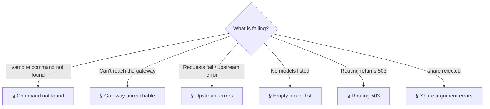
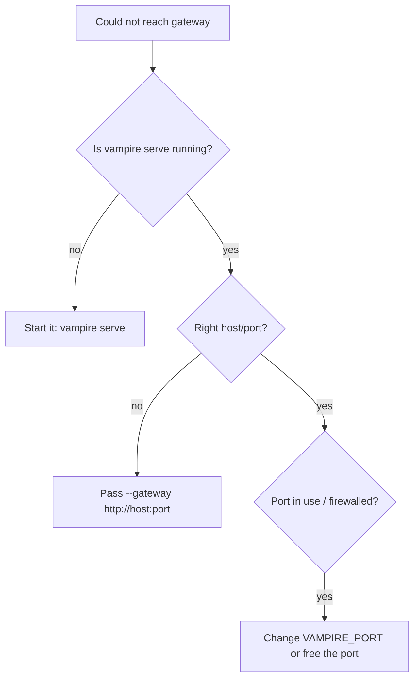
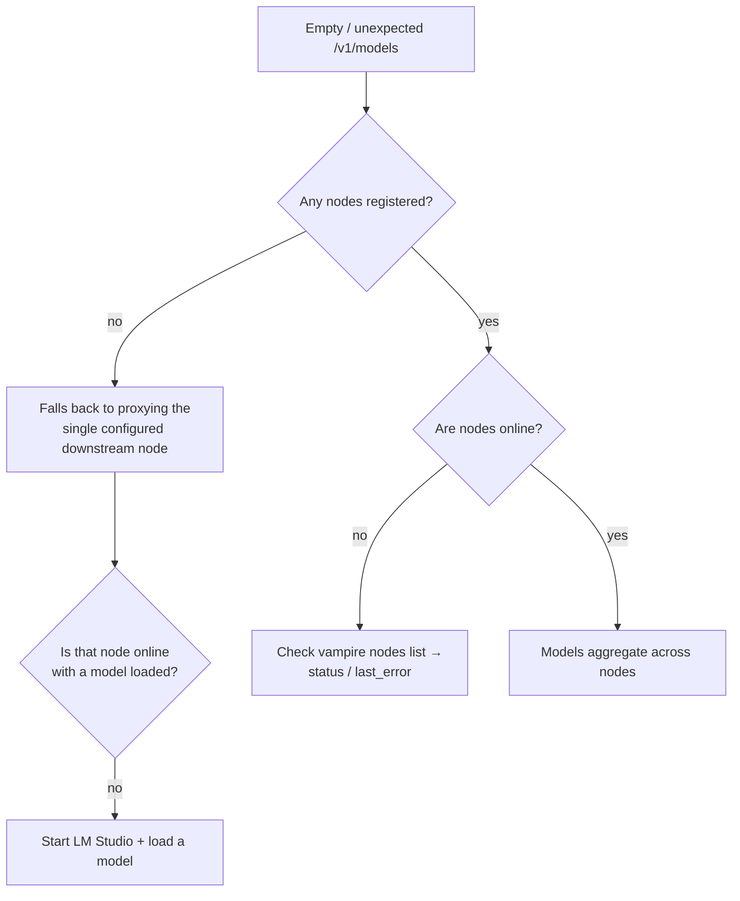
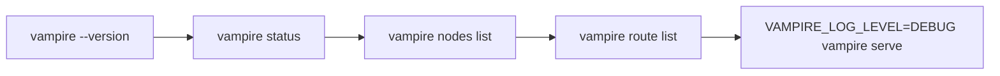

# 10. Troubleshooting

A field guide to the problems you are most likely to hit, and how to resolve
them. Start with the decision tree, then jump to the matching section.



---

## Command not found: `vampire`

The console script is not on your `PATH`.

- Confirm the install succeeded: `pip install -e ".[dev]"` from the repo root.
- If you used a virtual environment, activate it first
  (`source .venv/bin/activate`).
- Verify with `vampire --version`.

---

## Gateway unreachable

Symptom — control commands print:

```text
Could not reach Vampire gateway at http://127.0.0.1:7777: ...
```



- Start the gateway: `vampire serve`.
- If it runs on a non-default address, target it: `vampire status --gateway http://host:port`.
- If the port is already in use, set `VAMPIRE_PORT` or `vampire serve --port 8080`.

---

## Upstream errors when sending requests

Symptom — a `/v1/*` request returns an OpenAI-style error envelope even though
the gateway is up. Vampire forwards requests to LM Studio, so this usually means
the downstream node is the problem.

- Confirm LM Studio's server is running and reachable (default
  `http://localhost:1234`).
- Confirm the configured downstream URL is correct:
  `VAMPIRE_LMSTUDIO_BASE_URL`. See [Configuration](04-configuration.md).
- Confirm the `model` id you sent matches one from `GET /v1/models`.
- If LM Studio requires a token, the request must carry the owner's
  `Authorization` header — Vampire passes headers through transparently. See
  [`lmstudio.ai/06-authentication.md`](../../lmstudio.ai/06-authentication.md).

---

## Empty model list

`GET /v1/models` returns nothing useful.



- With no nodes registered, ensure the single downstream node is up and has a
  model loaded.
- With nodes registered, run `vampire nodes list` and check each node's `status`
  and `last_error`. Offline nodes contribute no models.

---

## Routing returns 503

Symptom:

```json
{ "error": { "type": "vampire_routing_error", "code": "no_route_target" } }
```

- The route resolved to **no online target**. Check that the route's target
  nodes are registered and online: `vampire route get <id>` and
  `vampire nodes list`.
- Add a `--fallback` virtual model when creating the route so traffic can
  divert. See [Routing](07-routing.md).
- Confirm the strategy is one of the accepted MVP strategies; an unsupported
  strategy is rejected at route-creation time with HTTP `400`.

---

## Share argument errors

Symptom:

```text
share off/stop do not accept an on/off state
```

- `off` and `stop` cannot take an `on`/`off` state argument. Use just
  `vampire share off`.
- Valid modes are `on`, `off`, `local`, `personal`, `family`, `business`,
  `event`, `stop`. See [Sharing modes](08-sharing-modes.md).

---

## Diagnostics checklist



Run these in order to localise an issue: confirm the install, the gateway, the
registry, the routes, and finally re-run the server with debug logging for the
fullest detail.

## Still stuck?

- Re-read the relevant chapter — most behaviour is documented with examples.
- Cross-check against [DESIGN-API.md](../../DESIGN-API.md) and
  [IMPLEMENTATION-PLAN.md](../../IMPLEMENTATION-PLAN.md) to confirm whether a
  feature is implemented or planned.
- Open an issue on the [repository](https://github.com/japer-technology/lmstudio-vampire).
