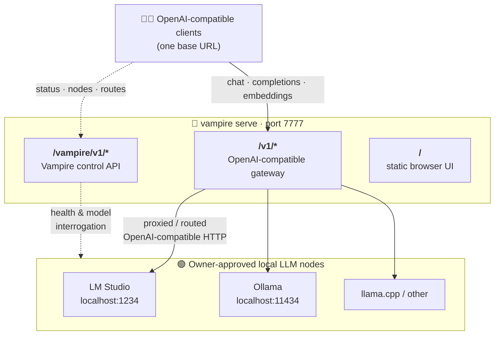

# LLM Vampire — User Manual

> A practical, task-oriented guide to installing, running, and operating the
> `llm-vampire` gateway.

This manual is the **operator's handbook** for `llm-vampire`. Where the
[design papers](../../README.md#documentation) explain *why* Vampire exists and
*what it aspires to become*, this folder explains *how to use what runs today*:
installing the package, starting the gateway, registering local LLM nodes,
routing requests, and pointing OpenAI-compatible clients at one stable endpoint.

`llm-vampire` turns owner-approved **local LLM API endpoints** into one governed,
private AI service behind a single OpenAI-compatible URL. It does not run models
or control GPUs itself—it connects only to services an owner has deliberately
exposed. For the full background, read the
[project README](../../README.md) and the
[`lmstudio.ai/`](../../lmstudio.ai/) technical reference.

---

> [!IMPORTANT]
> **What this manual covers.** Vampire is built in phases (see
> [IMPLEMENTATION-PLAN.md](../../IMPLEMENTATION-PLAN.md)). This manual documents
> the behaviour that ships in the current scaffold — **Phase 0** (foundations),
> **Phase 1** (transparent proxy), **Phase 2** (node registry + discovery), and
> **Phase 3** (routing), and **Phase 4** (dashboard). Features from later phases
> (cache, coalescing, auth/policy, fusion) are noted as **planned** where they appear, so
> you always know what works now versus what is on the roadmap.

---

## Contents

| # | Chapter | What it covers |
| --- | --- | --- |
| 1 | [Introduction](01-introduction.md) | What Vampire is, who it is for, and the mental model behind it. |
| 2 | [Installation](02-installation.md) | Requirements and installing the scaffold with `pip`. |
| 3 | [Quick start](03-quickstart.md) | Start the gateway and serve your first request in minutes. |
| 4 | [Configuration](04-configuration.md) | The `VAMPIRE_*` settings reference and `.env` support. |
| 5 | [CLI reference](05-cli-reference.md) | Every `vampire` command, flag, and exit code. |
| 6 | [Nodes & discovery](06-nodes-and-discovery.md) | Registering nodes and discovering reachable local LLM endpoints. |
| 7 | [Routing](07-routing.md) | Virtual models, route policies, strategies, and opt-in routing. |
| 8 | [Sharing modes](08-sharing-modes.md) | Owner sharing modes and the `vampire share` command. |
| 9 | [API reference](09-api-reference.md) | The `/v1/*` and `/vampire/v1/*` HTTP surfaces. |
| 10 | [Troubleshooting](10-troubleshooting.md) | Common problems and how to resolve them. |

---

## The shape of the system

One `vampire serve` process exposes three surfaces on a single port (default
`7777`):

- Point any OpenAI-compatible client at `http://localhost:7777/v1`.
- Use the [`vampire` CLI](05-cli-reference.md) or the `/vampire/v1/*`
  [control API](09-api-reference.md) to register nodes and inspect the cluster.

---

## Read this manual alongside

- [README.md](../../README.md) — project overview and project status.
- [DESIGN-API.md](../../DESIGN-API.md) — the full API specification this scaffold implements against.
- [IMPLEMENTATION-PLAN.md](../../IMPLEMENTATION-PLAN.md) — the phase-by-phase build plan.
- [METHOD-A.md](../../METHOD-A.md) — the FastAPI + browser construction method this code follows.
- [`lmstudio.ai/`](../../lmstudio.ai/) — how each LM Studio mechanism maps to a Vampire capability.

> **Design-stage note.** Like the rest of this repository, parts of this manual
> describe **intended** behaviour. Each chapter marks clearly what runs today and
> what is planned.
