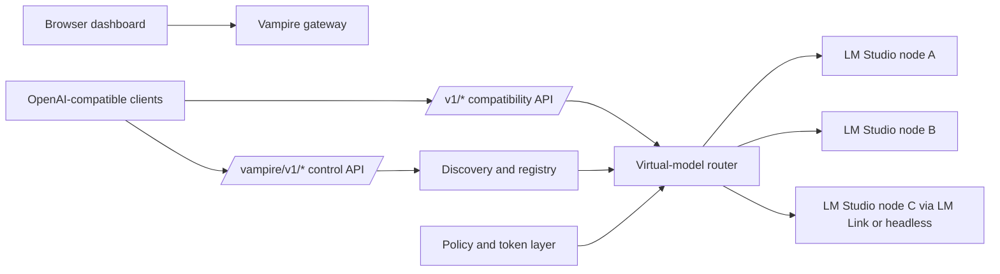
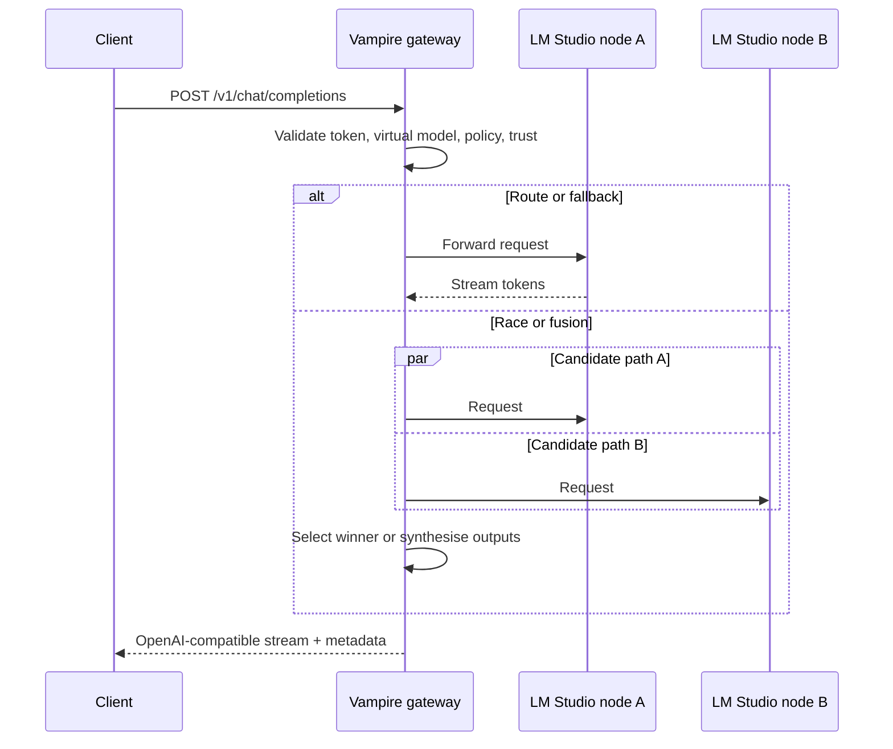

# Portable GPU Collaboration System

## Executive summary

This invention, as expressed in the `lmstudio-vampire` repository, is best understood as a **governed orchestration layer for private, heterogeneous AI inference nodes** rather than as a new GPU kernel, driver, or hardware interconnect. Its core move is to place a stable OpenAI-compatible gateway in front of **owner-approved LM Studio endpoints**, then add discovery, routing, virtual models, policy, consent, and collaboration modes such as route, race, fusion, debate, and pipeline. That is a materially different design point from single-host local AI servers, and also from deep model-sharding systems such as vLLM, EXO, or Petals. In that sense, the likely novelty is not “portable GPU” in isolation, but **portable, policy-governed, owner-consensual collaboration across nearby private AI compute**. citeturn46view2turn12view2turn12view3turn14view1

The strongest technical differentiators visible in the design papers are these: compatibility with existing OpenAI-style clients; a hardware-agnostic control plane that does **not** manage GPUs directly; explicit owner consent and revocation semantics; virtual models spanning multiple nodes; and an architecture aimed at heterogeneous deployment across desktops, headless boxes, remote links, and mobile-adjacent rigs. LM Studio already provides local and remote model serving, OpenAI-compatible endpoints, a native REST API, headless `llmster`, network serving, and LM Link over an end-to-end encrypted Tailscale-based overlay; Vampire’s role is to aggregate, govern, and optimise **across** such nodes under one service surface. citeturn46view2turn33view0turn33view3turn31view2turn31view3turn32view0

The repository’s current maturity is **early but non-zero**. The README still describes the project as design-stage and “not yet a runnable implementation”, yet the tree now contains an embryonic Python scaffold: a FastAPI app factory, declared dependencies, a CLI entry point, an in-memory node registry, a proxy seam, and smoke tests covering app creation, `/vampire/v1/status`, and a node-registration roundtrip. That means the invention has progressed from pure concept into a pre-MVP executable skeleton, but the routing, fusion, discovery, policy enforcement, and observability layers remain largely at design or scaffold stage. citeturn46view2turn43view0turn45view0turn45view1turn45view3turn45view6turn45view9turn45view10

From an industry-comparison perspective, the proposed system sits between several existing classes. Compared with LM Studio or Ollama, it aims to add **multi-node governance and collaboration**. Compared with EXO or Petals, it appears intentionally **less invasive**, because near-term Vampire routes among independent model servers rather than sharding model internals across cooperative runtimes. Compared with vLLM plus Ray Serve, it trades some deep-serving efficiency for easier deployment across mixed, private, owner-run devices. That positioning is strategically credible. The main execution risk is that the project must demonstrate real operational value beyond simple proxying: reliable failover, measurable throughput aggregation, low-overhead streaming, enforceable consent, and collaboration modes that justify the extra layer. citeturn31view5turn34view0turn26view0turn37view0turn35view0turn35view1

A preliminary IP scan suggests the surrounding field is already populated by patents covering machine-learning inference routing, API-proxy-mediated GPU sharing, edge-cloud inference management, and distributed inference engines that partition prompts or processing across multiple engines. The best protection opportunity is therefore likely to lie in **the specific combination** of owner-approved LM Studio node orchestration, public-policy-plus-secret consent tokens, live revocation and utilisation ceilings, virtual-model collaboration modes, and portability across private heterogeneous devices. Any patent strategy should be claim-narrow and architecture-specific, not broad and generic. citeturn39view0turn39view1turn39view2turn39view3turn15view0turn15view1

## Abstract

This paper analyses a proposed invention for a new class of portable GPU collaboration system, grounded in the `japer-technology/lmstudio-vampire` repository and supplemented by primary technical documentation, original research papers, and patent literature. The invention is designed as a governance and orchestration fabric over owner-approved LM Studio endpoints, exposing a stable OpenAI-compatible API while supporting discovery, routing, virtual models, policy controls, collaboration protocols, and multi-node execution modes. citeturn46view2turn12view2turn12view3turn33view0

The architecture is notable for being **GPU-location-agnostic**: it does not control accelerators directly, but rather coordinates approved model-serving nodes that may be local, remote, headless, GPU-backed, CPU-backed, or reached through LM Studio’s own remote-device layer. This positions the invention differently from both one-box local inference tools and tightly coupled distributed runtimes. The report therefore evaluates the invention as a system innovation at the intersection of private AI infrastructure, edge collaboration, local-network orchestration, and portable heterogeneous compute. citeturn46view2turn31view2turn31view3turn13view6

The analysis concludes that the concept is compelling for use cases where **privacy, owner control, portability, and heterogeneous deployment** matter more than absolute peak throughput for one monolithic model. The largest gaps are implementation maturity, benchmark evidence, and formalisation of the security, licensing, and commercial packaging story. The most important next step is to move from design-led architecture to a benchmarked MVP that proves route/failover value on mixed local nodes before advancing to fusion, debate, or contribution-led economic models. citeturn13view1turn14view1turn15view1turn36view0turn36view3

## Introduction

Local AI serving is increasingly feasible on laptops, desktops, workstations, and edge devices, but today’s user experience remains fragmented. LM Studio can expose models on `localhost` or the local network, can run headless through `llmster`, and can let one machine use a model loaded on a preferred remote device via LM Link. Ollama likewise offers a practical local daemon with partial OpenAI compatibility. These capabilities are useful, but they are fundamentally still **per-host** or **preferred-device** abstractions rather than a governed collaboration fabric spanning many approved private nodes. citeturn33view2turn31view3turn31view5turn32view0turn34view0

The repository defines the problem more ambitiously: owners may have multiple LM Studio machines, sometimes portable and sometimes stationary, with different models, trust levels, power states, and network exposure. The proposed system, Vampire, turns those owner-approved LM Studio endpoints into “one governed, private AI service” behind a stable OpenAI-compatible endpoint, while preserving owner control over whether servers are running, network-visible, token-protected, or JIT-loading models. That framing is significant because it shifts the unit of orchestration from “the GPU” to “the approved private inference endpoint”. citeturn46view2turn32view0turn33view3

The novelty claim is therefore strongest in the combination of three ideas. First, **compatibility-first integration**: existing OpenAI-style clients keep working by changing only the base URL. Secondly, **policy-aware collaboration**: virtual models, routing strategies, trust levels, owner share modes, and explicit opt-in ceilings are treated as first-class controls. Thirdly, **portable heterogeneity**: the system is designed to operate across local desktops, headless services, nearby nodes, and links between devices you own, without requiring that all participating machines run one tightly integrated distributed runtime. citeturn13view6turn14view0turn14view1turn15view0turn31view2

That design opens several high-value use cases. A mobile worker could use a lightweight laptop while dispatching demanding prompts to a home or office rig through approved private paths; a lab or classroom could pool a handful of mixed inference boxes behind one stable endpoint; a field team could combine compact local units with larger parked systems; and a sovereign-AI environment could keep model traffic inside owner-controlled devices instead of shipping prompts to public cloud APIs. LM Studio explicitly targets local and linked device scenarios, while portable hardware baselines such as Thunderbolt eGPU enclosures, Jetson Orin modules, and DGX Spark show that private AI compute is already becoming more compact and more mobile. citeturn31view2turn31view3turn40view0turn40view2turn38search6turn38search7

For this draft, I assume **no specific constraint** on budget, exact hardware model, physical envelope, or latency target. Where those missing constraints matter, I treat them as design variables and propose a benchmarking plan rather than asserting fixed deployment numbers.

## Technical architecture

At its core, the invention is an **overlay system** rather than a replacement inference engine. The README is explicit: Vampire does not discover or control GPUs directly; it connects only to LM Studio servers that an owner has deliberately exposed, whether locally, on a trusted network, through headless LM Studio, or through LM Studio’s own remote-device routing. It interrogates reachable endpoints for models, loaded instances, context limits, capabilities, and access requirements, then routes approved requests behind one stable OpenAI-compatible endpoint. citeturn46view2

The recommended construction method is a **single Python/FastAPI process** that serves three things at once: the OpenAI-compatible gateway under `/v1/*`, the Vampire control API under `/vampire/v1/*`, and the static browser UI at `/`. METHOD-A recommends FastAPI, Uvicorn, `httpx.AsyncClient`, `zeroconf`, and a state model that begins in memory and later introduces SQLite as a persistence seam. The actual scaffold already mirrors this direction: `app.py` builds a FastAPI app, includes the compatibility and control routers, and mounts the static UI directory when present; `pyproject.toml` declares FastAPI, Uvicorn, HTTPX, Pydantic, `zeroconf`, and `aiosqlite`. citeturn13view6turn14view0turn43view0turn45view10

From a software-stack perspective, the proposed system has four layers. **Compatibility** provides `/v1/models`, `/v1/responses`, `/v1/chat/completions`, `/v1/embeddings`, and `/v1/completions`, matching the endpoints exposed by LM Studio’s compatibility layer. **Control** adds node, route, discover, metrics, trace, and fusion concepts under `/vampire/v1/*`. **Policy** governs which nodes are eligible, trusted, or rate-limited. **Collaboration** introduces advanced execution modes such as race, fusion, parallel, debate, and pipeline. That layered structure is consistent across the README, DESIGN-API, METHOD-A, and the implementation plan. citeturn33view0turn13view1turn12view3turn14view1turn46view2

Networking is central to the invention. On the LM Studio side, servers can be exposed on `localhost` or on the network, can require API tokens through the `Authorization` header, and can enable or disable local-network serving, CORS, per-request MCP use, and JIT model loading. LM Studio can also run without the GUI through `llmster`, and LM Link can make remote devices appear local over end-to-end encrypted links built with Tailscale. On the Vampire side, the implementation plan specifies manual registration first, then health checks, model interrogation, `POST /vampire/v1/discover`, and later mDNS-based discovery, with `zeroconf` already present in dependencies. citeturn32view0turn31view1turn31view2turn31view3turn14view0turn45view10

The API model is more sophisticated than a simple reverse proxy. DESIGN-API defines **virtual models** whose targets can span multiple physical nodes and physical model identifiers, plus routing strategies such as `round_robin`, `weighted_round_robin`, `least_busy`, `least_latency`, `highest_tokens_per_second`, `best_available`, `model_affinity`, `context_window`, `trusted_only`, `power_saver`, `race`, `fallback_chain`, `quality_score`, `cost_score`, and `privacy_policy`. The design also includes metrics and trace endpoints so the system can explain which nodes were candidates, which were selected, what strategy was used, and how long each stage took. That makes the invention not merely a switchboard, but a potentially auditable control plane for collaborative inference. citeturn12view2turn12view3turn12view1

Security is one of the most original parts of the design. The security thesis separates **node-layer trust** from **client-layer trust**: LM Studio tokens represent owner consent and per-node permissions, while Vampire realm tokens represent client identity, authorisation, and accounting. Reachability is explicitly not consent. Consent is modelled through recognised policy tags such as `vampire`, `vampire50`, or more generally `vampire<NN>`, where the number represents a utilisation ceiling. Crucially, the design states that this tag is a **public label, not a credential**; where both declaration and secrecy are needed, the recommendation is a two-part token of the form `vampire<NN>:<secret>`. The scheduler is then responsible for enforcing the declared ceiling and respecting live tier changes or revocation. In a multi-Vampire mesh, signed node registration becomes mandatory. citeturn15view0turn15view1

This is an important security–commercialisation link. The consent model, if implemented well, gives the invention a basis for **portable collaboration without uncontrolled peer-to-peer freeloading**. It also gives a defensible difference from architectures that assume homogeneous cluster operators or open cooperative networks. In effect, the invention proposes that collaboration can be federated among private devices without giving up owner control, because the governance layer becomes the system’s real product. That interpretation is grounded in the repository’s design documents and is one of the strongest arguments for the invention’s distinctiveness. citeturn15view0turn15view1turn46view2

## Repository-grounded implementation status

The repository currently tells two stories at once. The README still states that the project is in design stage, that its intended installation and usage are planned rather than working today, and that the project is not affiliated with LM Studio unless explicitly adopted. At the same time, the code tree already contains a Python package, app factory, CLI, router scaffolds, and tests. The correct reading is therefore that the invention has moved from concept paper to **pre-MVP scaffold**, but the public narrative has not yet fully caught up with the codebase. citeturn46view2turn43view0turn45view6turn45view9

The implemented scaffold is coherent. `app.py` constructs a FastAPI application titled `lmstudio-vampire`, includes the compatibility and control routers, and serves the bundled dashboard asset when present. `pyproject.toml` declares the exact dependency stack anticipated by METHOD-A: FastAPI, Uvicorn, HTTPX, Pydantic, `zeroconf`, and `aiosqlite`, plus `vampire` and `vampire-desktop` console script entry points. The CLI imports the app factory directly for the serve path, while the desktop launcher targets packaged double-click startup. citeturn43view0turn45view10turn45view6

The current code also shows where the architecture is still incomplete. `proxy.py` contains an asynchronous `forward` function that builds a downstream URL from configured settings and uses `httpx.AsyncClient` to send a request, but its own docstring says it is a “placeholder seam” and “not yet wired” into the routes. `registry.py` is a small in-memory node registry backed by a dictionary, with a SQLite persistence seam planned for later. The data model already includes a `Node` abstraction plus `RouteTarget` and `RoutePolicy` classes, aligning with the design papers’ view of nodes and virtual-model routing rules. citeturn45view0turn45view1turn45view3turn45view8

The tests are encouraging because they confirm that the scaffold is not purely decorative. The smoke suite builds the app, checks the title, asserts that `/vampire/v1/status` returns a `vampire.status` object, and verifies a node-registration roundtrip using a node with `lmstudio_base_url` set to `http://localhost:1234`. That suggests the earliest control-plane semantics are already embodied in executable code, even if downstream model forwarding, discovery, failover, and fusion are not yet complete. citeturn45view9turn44view5

Against that progress, the feature gap remains substantial. The MVP definition explicitly narrows scope to a basic OpenAI-compatible gateway, manual node management, basic routing, bearer-token forwarding, and simple health checks. It explicitly defers request coalescing and cache, mDNS discovery, node agents, realms and policy engine, fusion/race/debate/pipeline, event mode, QR onboarding, and model optimisation/benchmarking. The implementation plan likewise places policy, fusion, traces, jobs, and per-realm metrics in later phases, with the node agent and JAPER signed-result envelope deferred beyond the MVP. citeturn13view1turn14view1

There is also one repository-governance issue worth addressing immediately: **licensing metadata appears inconsistent**. The repository page identifies an MIT licence, while the README still says “a licence has not yet been selected” and “all rights are reserved”. For an invention intended to gather design feedback, prototypes, and possibly external collaborators, this should be resolved at once; ambiguity here will complicate both patent filing strategy and community adoption. citeturn46view2

## Performance expectations and comparative analysis

The most realistic performance expectation is that **route-mode Vampire should behave like a low-overhead orchestration gateway whose aggregate cluster capacity approaches the sum of eligible node capacities**, minus control-plane costs and network effects. That expectation follows from the architecture: the near-term design forwards OpenAI-compatible HTTP requests to selected downstream LM Studio nodes, leaves execution on those nodes, and does not yet attempt deep tensor or KV-cache sharding. This should make heterogeneous deployment easier, but it also means the system will not automatically deliver the same kind of per-model scaling as vLLM-style tensor/pipeline parallel serving or EXO-style model placement across shards. That is an architectural inference from the repository and the comparison systems, not yet a measured result. citeturn46view2turn45view1turn35view0turn35view1turn26view0

Advanced modes shift the performance envelope. `race` can hedge latency by querying several candidates and returning the earliest or best result; `fusion`, `debate`, and `pipeline` can improve answer quality or workflow structure by using several specialised nodes; the design explicitly envisages patterns such as planner→executor→critic→final, code→test→review, and chunk summaries→global synthesis. The cost is obvious: fan-out modes duplicate work and will reduce effective cluster throughput per user-visible response unless the quality or latency gain justifies it. Research on DistServe and Sarathi-Serve reinforces the importance of separating throughput from user-perceived latency metrics such as TTFT and TPOT, especially once prefill and decode behaviour starts to matter under load. citeturn12view3turn12view1turn14view1turn36view0turn36view3

A rigorous benchmark programme should therefore measure both **service quality** and **orchestration quality**, not only raw tokens per second. The most appropriate core latency metrics are TTFT, end-to-end latency, TPOT, throughput, and goodput. NVIDIA’s benchmarking documentation defines TTFT and end-to-end latency clearly, while DistServe frames goodput as the maximum request rate that stays within both TTFT and TPOT constraints. For portable and workstation-class systems, MLPerf Client is especially relevant because it is designed specifically for personal computers running generative AI workloads locally. citeturn35view6turn36view0turn35view7turn36view6

| Benchmark dimension | Concrete plan | Primary rationale and source basis |
|---|---|---|
| Latency and throughput | Measure p50/p95/p99 TTFT, TPOT, end-to-end latency, output tokens/s, and goodput under streaming and non-streaming modes. Separate route, fallback, race, and fusion cases. | TTFT and end-to-end latency are standard serving metrics; DistServe treats TTFT+TPOT-constrained goodput as the principal serving objective. citeturn35view6turn36view0 |
| Client-comparable local performance | Run MLPerf Client scenarios on laptop/workstation-class nodes and on the gateway fronting those nodes. Use this as a portability-oriented baseline rather than a full cluster benchmark. | MLPerf Client is intended for PCs ranging from laptops to workstations and focuses on local generative-AI use cases. citeturn35view7turn36view6 |
| Chat quality | Use MT-Bench for multi-turn conversational ability and Arena-style pairwise evaluation for fusion/race variants. | MT-Bench was introduced to evaluate multi-turn conversation and instruction following in open-ended chat. citeturn29search0turn29search1turn29search3 |
| Embeddings quality | Use MTEB subsets to test whether routing or fallback changes embedding behaviour or throughput. | MTEB covers multiple embedding tasks and is a broad benchmark for text embeddings. citeturn28search1turn28search13 |
| Code-oriented quality | Use HumanEval pass@k for code-specialised virtual models and pipeline modes such as code→test→review. | HumanEval is the standard functional-correctness test released with the Codex paper. citeturn28search2turn28search10 |
| Real-world serving traces | Replay LMSYS-Chat-1M- or Chatbot-Arena-derived request distributions; add a bursty workload trace such as BurstGPT for admission-control and failover tests. | LMSYS-Chat-1M and Chatbot Arena provide real-world conversation data; BurstGPT provides serving workload traces for reliability and QoS studies. citeturn30search8turn30search2turn30search9 |
| Resilience and governance | Inject node failure, token revocation, tier changes, and trust downgrades mid-run. Measure failover time, policy correctness, dropped streams, and in-flight throttle behaviour. | The repository treats failover, live consent revocation, and enforced utilisation ceilings as first-class behaviours. citeturn13view1turn15view1 |

The testbed should be staged. First, a **single-node baseline** confirms that the gateway does not materially degrade LM Studio parity. Secondly, a **dual-node heterogeneous setup** should combine two unlike machines, for example a laptop against a headless box or an eGPU-backed portable host against a fixed workstation. Thirdly, a **three-to-five-node mixed topology** should include at least one device reached through LM Link or another encrypted overlay. If portable hardware is a design goal, one scenario should explicitly include a Thunderbolt eGPU host or compact local AI box, because those are the environments where the portable-collaboration thesis becomes commercially interesting. citeturn13view1turn31view2turn31view3turn40view0turn40view2turn38search7

The most important expected result is not a single peak number. It is a **shape**: minimal parity loss in single-node route mode; meaningful failover improvement in two-node mode; useful aggregate capacity across heterogeneous private nodes; and clear, bounded trade-offs when advanced fan-out modes are enabled. If the benchmark story instead shows that route mode adds significant latency with little resilience gain, the invention’s value proposition weakens sharply. If it shows low-overhead parity plus robust failover and practical aggregation, the design becomes much more defensible. citeturn13view1turn45view1turn36view0

| System | Core model | Portability | Scalability | Security and governance posture | Cost basis | Performance posture | Source basis |
|---|---|---|---|---|---|---|---|
| **Proposed portable GPU collaboration system** | Governed aggregation of approved LM Studio nodes behind one stable API | High across mixed private nodes | Horizontal across approved endpoints; advanced fan-out planned | Strong on consent tiers, trust, allowlists, realm tokens, traces | Software scaffold; hardware bring-your-own | Expected to excel in route/failover on heterogeneous private clusters; unmeasured today | citeturn46view2turn12view3turn15view1turn14view1 |
| **LM Studio with LM Link** | Single-host serving and preferred-remote-device use | High | Mostly one serving node per request path | API tokens, local-network controls, E2EE LM Link | Software; hardware bring-your-own | Strong for one-box or preferred-device workflows, not cluster aggregation | citeturn33view0turn31view2turn31view3turn32view0 |
| **Ollama** | Single-host daemon with OpenAI-style compatibility | High | Limited cluster story in official docs | Local API surface; cloud auth only where ollama.com access is involved | Software; hardware bring-your-own | Practical one-host serving, but not an orchestration fabric | citeturn34view0turn24search8 |
| **EXO** | Topology-aware local inference cluster with model placement across devices | High for Macs/workstations and nearby nodes | Multi-device local cluster | Official pitch emphasises discovery and topology more than consent governance | Software; hardware bring-your-own | Official site claims local cluster operation, standard APIs, and 8 μs latency with RDMA over Thunderbolt 5 | citeturn26view0 |
| **Petals** | Collaborative network where each participant serves part of the model | Medium | High collaborative scale | Depends on trust in participating servers; different threat model from private-owner fabric | Software/community hardware | Demonstrated collaborative large-model inference on consumer GPUs; official site cites up to 6 tok/s on Llama 2 70B and 4 tok/s on Falcon 180B | citeturn37view0turn35view2 |
| **vLLM with Ray Serve LLM** | Deep distributed serving with tensor/pipeline parallelism, autoscaling, PD disaggregation | Medium | Very high on planned clusters | Production cluster governance, observability, autoscaling | Software; server hardware bring-your-own | vLLM reports 2–4× throughput gains at similar latency; Ray adds built-in metrics and multi-node deployment patterns | citeturn35view0turn35view1turn36view4 |
| **DGX Spark** | Compact local AI box | Medium-high | Single box unless externally orchestrated | Standard host security, not collaboration-specific | Official NVIDIA Marketplace price US$4,699; 128 GB unified memory | Designed for local work with models up to 200B parameters on a desktop-class compact system | citeturn38search7turn38search9turn38search5 |
| **Laptop with Thunderbolt 5 eGPU** | Portable host augmented by external GPU enclosure | Medium-high | Single-host only unless combined with an orchestration layer | Host OS and interconnect security; no native collaboration logic | Sonnet enclosure pricing US$399.99–US$499.99 plus GPU; TB5 offers 80–120 Gbps link modes | Useful portable compute expansion, but not collaborative by itself | citeturn40view0turn40view1turn40view2turn41view0 |

The comparison makes the invention’s niche clear. It is **not** trying to beat vLLM on deep cluster efficiency, nor Petals on wide-open collaborative scale, nor EXO on direct model sharding. It is trying to provide something those systems do not foreground: a familiar OpenAI-compatible service boundary for **owner-controlled, policy-governed collaboration among private heterogeneous nodes**. That niche is plausible and commercially meaningful, especially if the first versions target people who already run LM Studio and want multi-node capability without adopting a wholly different serving stack. citeturn46view2turn35view0turn26view0turn37view0

## Applications, IP landscape and roadmap

The most natural deployment scenarios are those where users already have **a small constellation of private devices** rather than a formal data-centre cluster. One scenario is the “light laptop, heavy home rig” model already suggested by LM Link, but extended so that several approved nodes can sit behind one stable endpoint. Another is the small lab, classroom, or consultancy environment, where a handful of machines can present one consistent internal API while keeping models and prompts on local infrastructure. A third is the edge and field setting, where compact devices such as Jetson Orin modules, DGX Spark-class systems, or portable eGPU hosts can contribute to a private pool without requiring a full cluster stack. citeturn31view2turn31view3turn38search6turn38search7turn40view0

The main limitations today are straightforward. The project is still immature; performance is unproven; discovery, cache, policy engine, fusion, and advanced observability are not yet MVP-complete; and several governance-heavy features remain deferred. There is also a practical portability risk: mobile and mixed-device deployments will inherit the variability of Wi‑Fi, Ethernet, Thunderbolt, Windows driver stacks, and host thermals. The invention avoids some of the complexity of deep distributed runtimes, but it does not escape the operational messiness of heterogeneous local hardware. citeturn13view1turn14view1turn31view3turn40view2turn38search16

The preliminary patent landscape is crowded enough that a broad “distributed inference across multiple devices” claim is unlikely to be distinctive on its own. Adjacent art clearly exists around machine-learning inference routing, GPU sharing through API proxies, edge-cloud inference management, and distributed inference engines that divide prompts or processing across multiple engines. What appears more distinctive in this invention is the **specific governance-centred combination** of: LM Studio endpoint aggregation; explicit owner approval; public policy tiers plus secret suffix tokens; live revocation; utilisation ceilings enforced by the scheduler; virtual models; and collaboration modes exposed through a compatibility-first API surface. A formal patentability assessment should therefore focus on combinations and constraints, not generic distributed-inference language. citeturn39view0turn39view1turn39view2turn39view3turn15view0turn15view1

The most sensible roadmap is the one already latent in the repository, but tightened around proof. First, ship the **smallest hard proof**: route/fallback parity against one and then two LM Studio nodes, with no regression for normal `/v1/*` clients. Secondly, implement the node registry, health checks, and observability deeply enough that failover can be benchmarked and explained. Thirdly, complete the policy layer—realm tokens, node allowlists, token vault behaviour, and consent-tier enforcement—before attempting economic contribution models. Fourthly, add race and fusion only after route mode is benchmark-clean, because advanced fan-out without stable foundations will obscure where latency or failures really come from. Fifthly, package the system for genuine portable deployment, ideally around the repo’s proposed `vampire serve` install path and browser dashboard. citeturn14view0turn14view1turn13view1turn46view2

A commercially strong near-term positioning would be: **“private multi-node local AI for people who already run LM Studio”**. That message is narrower than the full vision but stronger for adoption. It matches the current implementation plan, makes the benchmark story tractable, and creates a platform on which larger claims—portable compute fabrics, owner-governed contribution networks, household or small-team AI clouds—could later be built with real evidence rather than aspiration alone. citeturn46view2turn14view0turn14view1

Open questions remain. The design does not yet specify concrete routing heuristics for heterogeneous prompt classes in enough measured detail. The interface between LM Studio’s native `/api/v1/*` features and Vampire’s control plane still needs implementation choices, especially around model management, MCP, and stateful chat features that compatibility endpoints do not expose. The contribution and metering story is conceptually rich, but without the deferred policy and signed-registration pieces it is not yet deployment-grade. And the public repository should reconcile its status and licensing statements before external collaborators or commercial partners are invited in. citeturn33view3turn14view1turn15view1turn46view2
