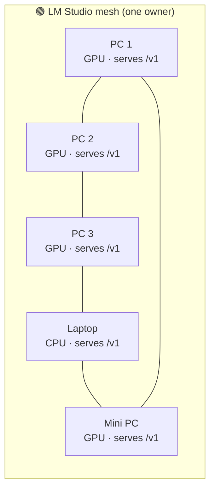

# 01 — The LM Studio Mesh Layer

> The first leap: several computers, any number of GPUs, one cross-machine API.

## The picture

LM Studio already does something astounding on its own. Take five ordinary
computers on a network. Any of them — one, several, or all — may have a GPU. Each
runs LM Studio and **serves its own OpenAI-compatible API** on the local network.
Link them together and you no longer have five isolated machines; you have a
**cross-machine mesh** of private inference that any approved client can reach.

This is *Layer 1*. It exists before Vampire is involved at all, and it is the
foundation everything else in this catalogue builds on.

## The topography

- **Nodes.** Each computer is a node. A node is just an LM Studio instance with
  "Serve on Local Network" enabled, listening on an owner-chosen port.
- **Heterogeneous by design.** GPUs are unevenly distributed. The mesh does not
  care: a strong GPU box, a modest laptop, and a CPU-only machine can all
  advertise whatever models they can actually run.
- **Cross-machine, not cloud.** Every endpoint stays on the local network. No
  prompt leaves the trusted boundary to make the mesh work.
- **The compute may live elsewhere.** Through LM Studio's own remote-device
  routing (LM Link), a node's *endpoint* can be local while its *GPU* sits on
  another machine. The mesh sees an endpoint; it does not need to know where the
  silicon is.

## Who controls what

At this layer, control is entirely LM Studio's, per machine. Each owner decides:

- whether the server is running at all;
- whether network access is enabled;
- which port is exposed;
- which models are loaded or may load on demand;
- whether an API token is required to connect.

Nothing in this catalogue ever bypasses those switches. A node contributes
exactly what its owner has chosen to offer — no more.

## What it unlocks

- **Aggregate throughput.** Independent prompts can be split across machines, so
  the group serves more concurrent work than any single box.
- **More models reachable.** Different nodes can hold different models; together
  the mesh advertises a richer catalogue than one machine could load at once.
- **Resilience.** When a node sleeps, unloads a model, or is switched off, the
  others remain reachable.

## Where it stops — and why Layer 2 exists

A raw mesh is powerful but awkward. Clients must know each machine's address,
notice when one disappears, and choose which to call. There is no single front
door, no shared policy, no discovery, no aggregation.

That gap is exactly what the **[Vampire broadcast layer](02-vampire-broadcast-layer.md)**
fills.

---

**See also:** [`../../lmstudio.ai/02-api-server.md`](../../lmstudio.ai/02-api-server.md)
("Serve on Local Network"), [`../../lmstudio.ai/09-lm-link.md`](../../lmstudio.ai/09-lm-link.md)
(remote compute), and [`../../lmstudio.ai/12-vampire-integration.md`](../../lmstudio.ai/12-vampire-integration.md)
(mechanism → capability mapping).
