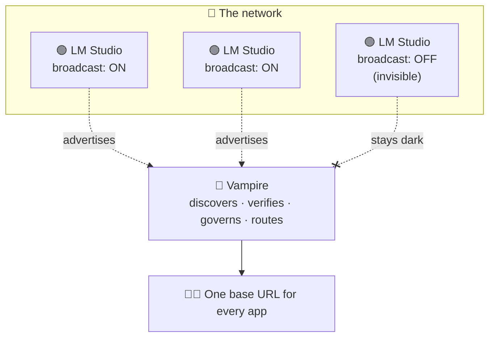

# 02 — The Vampire Broadcast Layer

> The layer that looks for networks, finds what is offered, and presents one door
> — while every owner keeps the keys.

## The picture

The [LM Studio mesh](01-lm-studio-mesh-layer.md) gives us machines that serve
APIs. Vampire is the layer above. An LM Studio server has a simple option that
amounts to **"broadcast on this network"** — it advertises that it is here and
reachable. Vampire **listens for those broadcasts**, interrogates each server it
finds, and presents the whole fleet behind a single, stable, OpenAI-compatible
endpoint.

The owner of each server is never displaced. They stay in command through three
plain controls: **keys, an on/off switch, and a password.**

## The topography

- **Discovery, not intrusion.** Vampire finds nodes through opt-in methods —
  static lists, mDNS, UDP broadcast, and bounded LAN scans (`POST
  /vampire/v1/discover`). It can only see servers that have chosen to be
  reachable.
- **Verify before trust.** For each discovered node, Vampire checks the real
  model inventory, loaded instances, context limits, capabilities, and access
  requirements. It advertises only what is actually available.
- **One front door.** Clients change a single base URL. Vampire routes, load
  balances, fails over, and aggregates behind it — the mesh's churn is hidden.
- **Cross-owner by design.** A mesh belongs to one owner; a *broadcast network*
  may carry servers from many owners. Vampire federates them under explicit
  policy, which is precisely the layer LM Studio itself stops short of.

## The owner's switchboard

Vampire is a **governed routing layer over consented endpoints** — never a
compute parasite. Each LM Studio owner controls the offer:

| Control | What it does |
| --- | --- |
| **On/off switch** | "Broadcast on network" toggles whether Vampire can see the server at all. Off means dark. |
| **Password** | Gates who may join the broadcast network and be eligible for routing. |
| **Keys (API tokens)** | Per-token permissions decide which models and actions a connection may use; revoking a key withdraws access instantly. |

Vampire holds these credentials in its token vault and presents them per node. It
**can only use what LM Studio offers**, and the moment an owner flips a switch,
changes a password, or revokes a key, the offer changes — and Vampire honours it.

## What it unlocks

- **Zero-configuration joining.** Turn on broadcast, and a machine becomes part
  of the shared service without anyone editing a client config.
- **Graceful churn.** Machines appear and vanish; the single endpoint stays put.
- **Pooling across people.** The scenarios that follow —
  [a business](03-business-pooled-compute.md) and
  [a student between home and school](04-student-home-and-school.md) — are all
  this layer applied to real relationships of trust.

---

**See also:** [`../../DESIGN-API.md`](../../DESIGN-API.md) (discovery, tokens,
realms, policy), [`../../lmstudio.ai/06-authentication.md`](../../lmstudio.ai/06-authentication.md)
(per-token permissions), and [`../../WORLD-CHANGING.md`](../../WORLD-CHANGING.md)
(why consent is the whole point).
