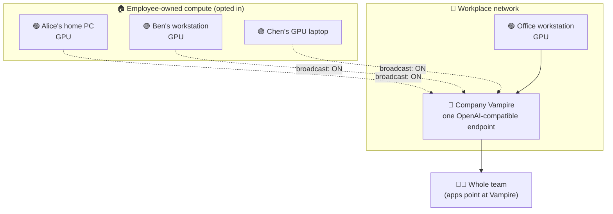

# 03 — Business Pooled Compute

> Employees bring their home resources into work, and together the team gets more
> than any of them could get alone.

## The picture

A business runs a Vampire on its own network. Each employee already owns capable
hardware — a gaming PC at home, a workstation, a GPU laptop. When they are at
work (or connected back to the office), they let their machine **broadcast its
LM Studio endpoint** to the company Vampire. Individually, each rig is a single
private assistant. Pooled, they become a **shared, private inference service**
that handles more concurrent work, reaches more models, and stays inside the
company's trust boundary.

## The topography

- **Trust follows the institution.** The people already work together; Vampire
  just makes that existing trust operational as shared compute.
- **Bring-your-own-compute.** Capacity the company never bought — idle home GPUs
  — is offered for the workday and withdrawn afterwards.
- **More together than apart.** One person's PC serves one person. Five pooled
  rigs serve the team in parallel, split batch jobs, and cover for each other on
  failure.
- **Local-first.** Business plans, source code, and internal material are
  processed on machines the company and its people already trust, not sprayed
  into third-party APIs.

## Who controls what

- **Each employee** owns their switch. "Broadcast on network" is theirs to flip;
  off-hours, the machine goes dark and contributes nothing.
- **The company Vampire** sets policy: which realms exist, which tokens are
  valid, what each role may use, and quotas to keep one job from starving the
  pool.
- **Keys and passwords** gate who may join the broadcast network and what they
  may do — revocable the instant someone leaves the team.

No machine is ever conscripted. Vampire can only route to what an owner has
deliberately offered, and only to users the company has approved.

## What it unlocks

- **Cheaper scaling.** Reuse workstation and home capacity before renting more
  cloud compute.
- **Burst capacity on demand.** Big review, summarisation, or embedding jobs fan
  out across every opted-in rig, then the borrowed capacity goes home.
- **A private team assistant** that belongs to the company's network rather than
  a cloud account.

---

**Related:** the mechanics here are the [broadcast
layer](02-vampire-broadcast-layer.md) applied to a workplace. For the family
variant, see [a student between home and school](04-student-home-and-school.md).
