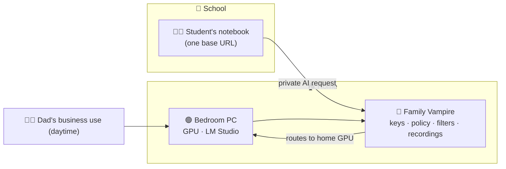

# 04 — Student: Home & School

> The PC in the bedroom does two jobs — Dad's business by day, the student's
> private, parent-governed schoolwork from the classroom — without either
> intruding on the other.

## The picture

A capable PC was given to a student and sits in their bedroom. During the day,
Dad happens to use it for the family business. The student has their own
notebook, and at school they want serious AI help for their own work. Instead of
renting cloud AI or hauling the desktop around, the student's notebook reaches
**back to the home PC's LM Studio endpoint** through the family's Vampire — using
the bedroom GPU for private study while the parent's controls stay firmly in
place.

## The topography

- **One machine, two trusted uses.** The bedroom GPU serves the parent's
  business locally and, through Vampire, the student's schoolwork remotely —
  governed as separate realms so the workloads don't bleed into each other.
- **Compute follows the person.** The student's notebook is weak; the home GPU is
  strong. Vampire lets the capable machine do the work while the student simply
  sees a working endpoint.
- **A private alternative to cloud AI.** Homework, drafts, and research are
  processed on the family's own trusted hardware rather than a third-party
  account.

## Parental control is the whole point

This topography only makes sense because the parent stays in command. The family
Vampire sits between the student and the home GPU and enforces, in layers:

| Layer | What the parent sets |
| --- | --- |
| **On/off switch** | Whether the home PC broadcasts and is reachable from school at all. |
| **Password & keys** | That only the student's notebook may connect, with a key that is revocable at any time. |
| **Filters** | Which models and which kinds of content are permitted for the student's realm. |
| **Recordings** | An auditable log of what was asked and answered, for parental oversight. |
| **Quotas / hours** | When and how much the student may use the home resource. |

Because Vampire can only route what the LM Studio owner offers, the parent's
switchboard is the ceiling on everything the student can do. Tighten a filter or
flip the switch, and the change takes effect immediately.

## What it unlocks

- **Private, capable schoolwork** without a cloud subscription or a second GPU.
- **Reuse, not duplication.** The family's existing investment serves both the
  business and the student.
- **Trust made operational.** A parent can extend powerful AI to their child on
  terms they author and can withdraw — the opposite of an unsupervised public
  chatbot.

---

**Related:** this is the [broadcast layer](02-vampire-broadcast-layer.md) and its
owner switchboard applied to a family. For the workplace variant, see
[business pooled compute](03-business-pooled-compute.md).
