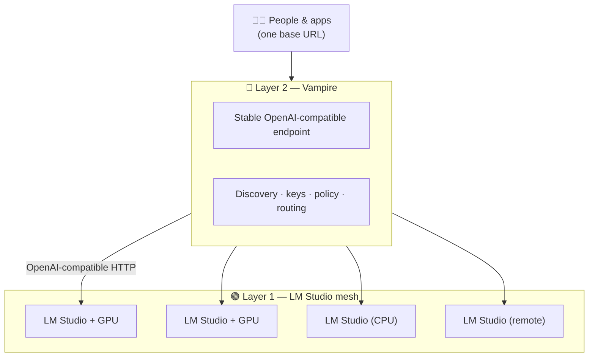

# Use Cases — Network Topographies for LM Studio Vampire

> Where private, owner-controlled AI compute becomes more than the sum of its
> machines.

`lmstudio-vampire` is interesting precisely because it does not invent compute —
it **coordinates compute that already exists**. The value appears the moment two
or more LM Studio endpoints, owned by people who already trust each other, are
pooled behind one stable, governed, OpenAI-compatible endpoint.

This folder is a succinct catalogue of the **network topographies** where that
coordination pays off — who owns the machines, where they sit, how they are
discovered, and what the owner stays in control of.

---

## The two layers

Almost every topography in this catalogue is built from the same two layers.
Read these first; the scenarios then become variations on a theme.

```text
Layer 2  🧛  Vampire     discovery · governance · routing · one stable API
                          ▲
                          │  "looks for networks that broadcast"
                          │
Layer 1  🟢  LM Studio    the machines · the GPUs · the models · the API
```

1. **[The LM Studio mesh layer](01-lm-studio-mesh-layer.md)** — LM Studio's own
   first leap: several computers, any of which may have a GPU, each serving an
   OpenAI-compatible API on the local network. Linked together, they already
   form a cross-machine mesh of private inference.

2. **[The Vampire broadcast layer](02-vampire-broadcast-layer.md)** — the layer
   above. Vampire **looks for LM Studio servers that broadcast on the network**,
   then presents the whole fleet as a single endpoint. The owner of each server
   stays in command through **keys, an on/off switch, and a password**.



---

## Topography catalogue

| # | Topography | Who pools compute | The unlock |
| --- | --- | --- | --- |
| 1 | [LM Studio mesh](01-lm-studio-mesh-layer.md) | One owner, several machines | Many GPUs become one cross-machine API |
| 2 | [Vampire broadcast](02-vampire-broadcast-layer.md) | Many owners, one network | Servers advertise; Vampire aggregates under owner consent |
| 3 | [Business pooled compute](03-business-pooled-compute.md) | Employees + the workplace | Home rigs join work to do more together than apart |
| 4 | [Student: home & school](04-student-home-and-school.md) | A family's PC, used from school | A bedroom GPU powers private, parent-governed schoolwork |

Each scenario document follows the same shape: **the picture**, **the
topography**, **who controls what**, and **what it unlocks**.

---

## Read this catalogue alongside

- [`../../VISION.md`](../../VISION.md) — the one-paragraph thesis.
- [`../../WORLD-CHANGING.md`](../../WORLD-CHANGING.md) — why owner-offered private
  compute is a new category.
- [`../../DESIGN-API.md`](../../DESIGN-API.md) — the API, including `POST
  /vampire/v1/discover` (`static`, `mdns`, `udp_broadcast`, `lan_scan`).
- [`../../lmstudio.ai/12-vampire-integration.md`](../../lmstudio.ai/12-vampire-integration.md)
  — how each LM Studio mechanism maps to a Vampire capability.

> **Design-stage note.** Like the rest of this repository, these documents
> describe the **intended** experience. They guide implementation; they do not
> describe software that runs today.
