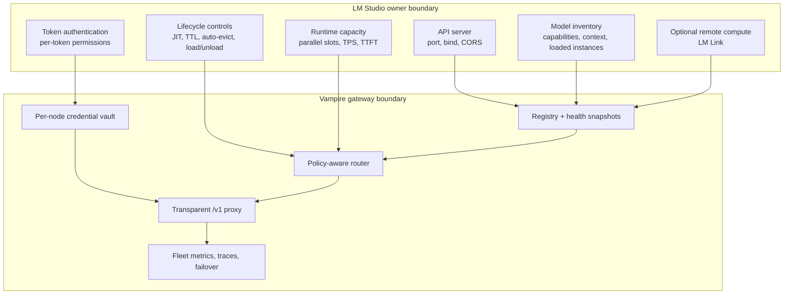
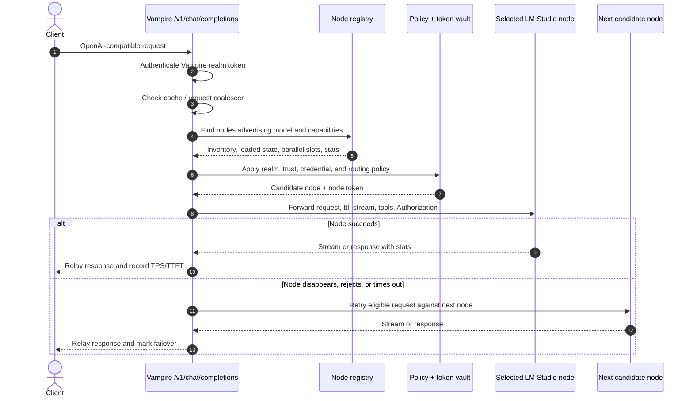

# 12 — Mapping LM Studio Mechanisms to the Vampire Design

This document is the synthesis: how each LM Studio mechanism documented in this folder
powers a specific part of Vampire's design ([`../VISION.md`](../VISION.md),
[`../DESIGN-API.md`](../DESIGN-API.md)).

## Mechanism → Vampire capability

| LM Studio mechanism | Doc | Vampire capability it enables |
| --- | --- | --- |
| API server with owner-set port/bind | [02](02-api-server.md) | Node registration by `base_url`; reachability is owner opt-in |
| "Serve on Local Network" | [02](02-api-server.md) | LAN-wide node fleets — Vampire's core premise |
| OpenAI-compatible `/v1/*` | [03](03-openai-compat.md) | Transparent proxying; clients change only the base URL |
| Anthropic-compatible `/v1/messages` | [03](03-openai-compat.md) | Optional second compatibility surface |
| `GET /api/v1/models` (capabilities, loaded instances, `parallel`) | [04](04-rest-api-v1.md) | Node interrogation: inventory, context limits, capabilities, concurrency |
| `POST /api/v1/models/load` / `unload` | [04](04-rest-api-v1.md) | Pre-warming and rebalancing (when token permissions allow) |
| `GET /api/v0/models` (`state` field) | [05](05-rest-api-v0.md) | Loaded-vs-loadable distinction on pre-0.4.0 nodes |
| v0 response `stats` (TPS, TTFT) | [05](05-rest-api-v0.md) | Empirical inputs to latency/quality routing strategies |
| API tokens with per-token permissions | [06](06-authentication.md) | Token vault; per-node credentials; owner consent and revocation |
| JIT loading | [07](07-model-lifecycle.md) | Routing to any downloaded model; cold-start cost modeling |
| Idle TTL + Auto-Evict | [07](07-model-lifecycle.md) | Eviction-aware, model-sticky routing; `ttl` pass-through |
| llmster / headless mode | [08](08-headless.md) | Always-on, server-grade nodes; provisioning recipes |
| LM Link | [09](09-lm-link.md) | Endpoints whose compute lives elsewhere; "Vampire doesn't need to know where the GPU is" |
| `lms` CLI | [10](10-cli.md) | Owner-side scripting of everything above |
| Continuous batching (`parallel`) | [11](11-concurrency.md) | Per-instance capacity for `least_loaded` routing |

## Capability stack

## The Vampire request path, annotated

## What LM Studio does NOT provide (Vampire's added value)

LM Studio deliberately stops at the single-owner boundary. Vampire adds the layer
above it:

- **Cross-owner federation** — LM Link networks belong to one account; Vampire
  aggregates endpoints from many owners under explicit policy.
- **A node registry with trust levels and realms** — LM Studio has no concept of a
  fleet of third-party servers.
- **Routing strategies, failover, and load balancing across servers** — LM Link picks
  a *preferred device*; it does not load-balance, race, or fail over.
- **Request coalescing and result caching** — no LM Studio equivalent.
- **Fusion modes** (parallel, race, judge/refine, debate) — orchestration across
  independent inferences is entirely Vampire's.
- **Cross-node metrics, traces, and governance** — LM Studio reports per-request
  stats; Vampire turns them into fleet-level observability and policy.

## Constraints Vampire inherits (and must never violate)

1. **The owner's switchboard is law.** Server on/off, bind address, port, auth,
   token permissions, JIT, TTL, model set — all owner-controlled; Vampire only ever
   consumes what is offered ([02](02-api-server.md), [06](06-authentication.md),
   [07](07-model-lifecycle.md)).
2. **No side channels.** Vampire interacts with nodes exclusively through the four
   documented HTTP surfaces — never the owner's OS, files, or `lms` CLI.
3. **Version heterogeneity.** Interrogation must degrade across the fallback chain
   `/api/v1/models` → `/api/v0/models` → `/v1/models` ([01](01-overview.md),
   [05](05-rest-api-v0.md)).
4. **Everything is a snapshot.** Models load, evict, and migrate (LM Link) behind
   Vampire's back; all inventory data is advisory and must be re-verified or handled
   with failover.
