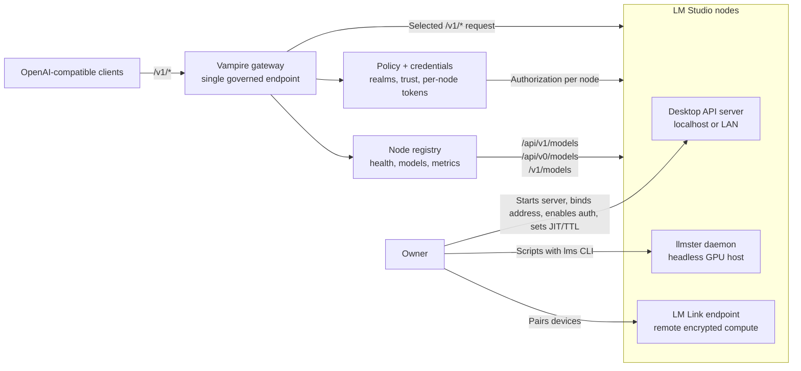
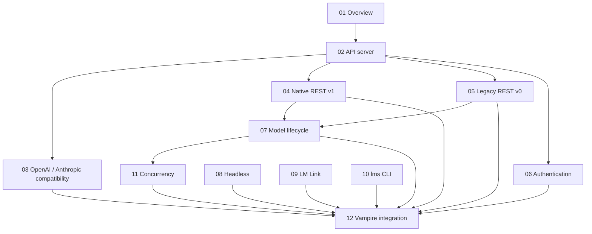
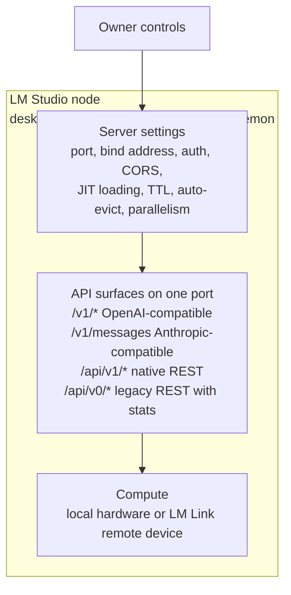

# lmstudio.ai — LM Studio Technical Reference for Vampire

This folder is a deep technical study of [LM Studio](https://lmstudio.ai/) — the platform
that `lmstudio-vampire` builds on. It collects every LM Studio mechanism that Vampire's
design depends on: the API server, its endpoint surfaces, authentication, model lifecycle,
headless operation, remote-device routing (LM Link), the `lms` CLI, and concurrency.

All information is sourced from LM Studio's official documentation at
[lmstudio.ai/docs](https://lmstudio.ai/docs) (source repository:
[lmstudio-ai/docs](https://github.com/lmstudio-ai/docs)). LM Studio evolves quickly;
where versions matter, the required LM Studio version is noted.

> **Why this folder exists.** Vampire does not discover or control GPUs directly. It
> connects only to LM Studio servers an owner has deliberately exposed, interrogates
> what those servers offer, and routes approved requests behind one stable
> OpenAI-compatible endpoint (see [`../VISION.md`](../VISION.md) and
> [`../DESIGN-API.md`](../DESIGN-API.md)). Every Vampire capability therefore rests on a
> concrete LM Studio mechanism documented here.

## Contents

| Doc | What it covers | Why Vampire needs it |
| --- | --- | --- |
| [01-overview.md](01-overview.md) | LM Studio platform components: desktop app, llmster daemon, `lms` CLI, SDKs | Knowing every form an upstream node can take |
| [02-api-server.md](02-api-server.md) | Running the API server, port, network binding, CORS, server settings | How owners expose endpoints Vampire can reach |
| [03-openai-compat.md](03-openai-compat.md) | OpenAI-compatible `/v1/*` endpoints | The surface Vampire proxies transparently |
| [04-rest-api-v1.md](04-rest-api-v1.md) | Native REST API `/api/v1/*` (LM Studio 0.4.0+) | Rich model inventory, load/unload control |
| [05-rest-api-v0.md](05-rest-api-v0.md) | Legacy REST API `/api/v0/*` (LM Studio 0.3.6+) | Per-request stats (TPS, TTFT) and model state |
| [06-authentication.md](06-authentication.md) | API tokens, permissions, the `Authorization` header | Respecting owner access requirements |
| [07-model-lifecycle.md](07-model-lifecycle.md) | JIT loading, idle TTL, auto-evict, explicit load/unload | Predicting node behavior before routing |
| [08-headless.md](08-headless.md) | llmster daemon and headless desktop mode | Server-native nodes without a GUI |
| [09-lm-link.md](09-lm-link.md) | LM Link end-to-end-encrypted remote-device routing | LM Studio's own link layer behind an endpoint |
| [10-cli.md](10-cli.md) | The `lms` CLI | How owners script and operate nodes |
| [11-concurrency.md](11-concurrency.md) | Parallel requests via continuous batching | Node capacity for load-aware routing |
| [12-vampire-integration.md](12-vampire-integration.md) | Mechanism-by-mechanism mapping to Vampire's design | The synthesis: how Vampire uses all of the above |

## Executive architecture map

## Documentation flow

## The mechanism in one page

An LM Studio node, as Vampire sees it:

Vampire's job (per [`../DESIGN-API.md`](../DESIGN-API.md)) is to sit in front of one or
more of these nodes, interrogate them through the read-only surfaces above, honor the
owner's settings, and present a single governed endpoint to clients.
